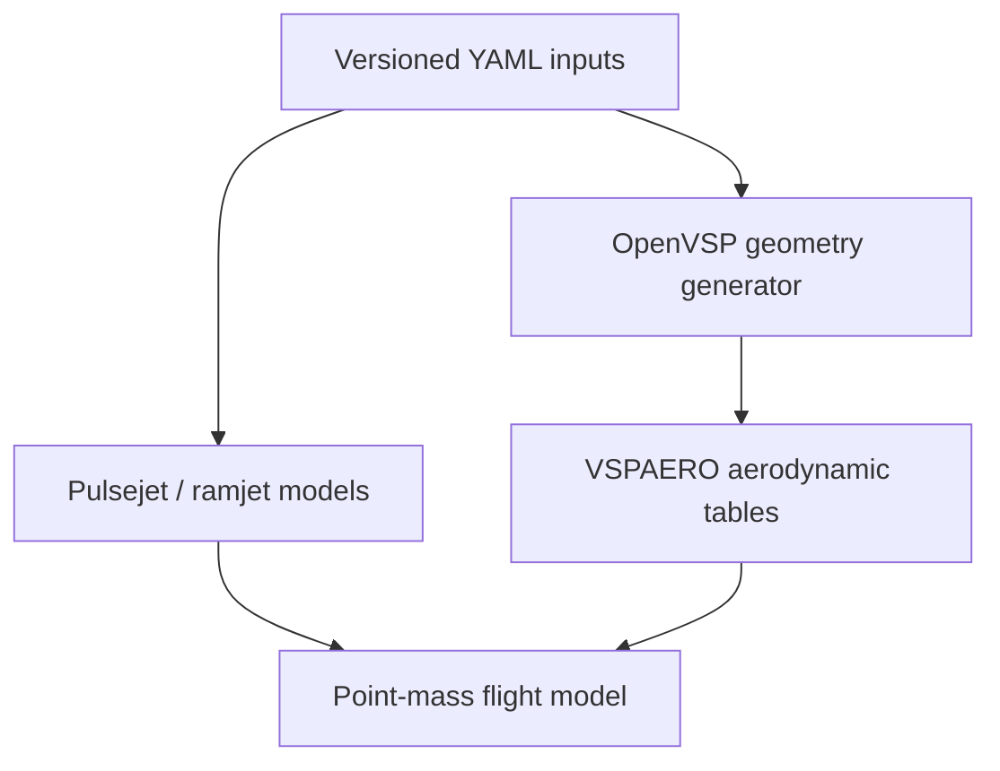

# Model architecture

## Discipline boundary

The propulsion and flight models are connected through explicit, inspectable
interfaces rather than one monolithic simulation.

VSPAERO will provide external aerodynamic forces, moments, and stability data. It
will not be used for combustor or nozzle reacting flow.

## Intake selector

The user requirement is encoded directly:

\[
A_{available}=f_{open}A_{circular},\qquad f_{open}=0.5
\]

The flow restriction then applies a separate discharge coefficient. This prevents
geometric blockage from being silently combined with loss calibration. Only one
mode can be selected at a time by `DualModePropulsion`.

## Pulsejet state and sequence

The chamber is a well-stirred, constant-volume control volume. Its dynamic state is
total mass, fresh-air mass, unburned-fuel mass, internal energy, and pending
chemical heat release. The step sequence is:

1. Check whether pressure, refill mass, and minimum-period ignition criteria are met.
2. Schedule a finite-duration heat release for the burnable fuel/air charge.
3. Calculate forward inlet flow from the recovered freestream stagnation reservoir.
4. Calculate nozzle blowdown from instantaneous chamber pressure and temperature.
5. Apply inlet/outlet enthalpy transport, combustion heat release, and wall loss.
6. Recover pressure from the ideal-gas constant-volume relation.

The governing lumped energy relation is

\[
\frac{dU}{dt}=\dot m_{in}h_{in}-\dot m_{out}h_{out}+\dot Q_{comb}-\dot Q_{wall}.
\]

This provides the requested rise, decay, pressure-differential intake, combustion,
and repeat behavior. It does not prove that an acoustic mode will sustain itself;
that requires calibration or a higher-order gas-dynamics model.

The simulator maintains a cumulative control-volume ledger for air and fuel inflow,
exhaust outflow, transported enthalpy, released chemical heat, rejected heat, and
any numerical energy-floor correction. The reported balance residuals test whether
the implementation closes; they do not validate the underlying lumped assumptions.

## Fixed C-D nozzle

The nozzle model uses the full area-Mach relation to distinguish three regimes:
fully subsonic flow, a sonic throat followed by an internal normal shock, and a
supersonic geometric exit. The internal-shock location is solved so the downstream
subsonic exit pressure matches ambient. For a supersonic exit it uses

\[
F_g=\dot m V_e+(p_e-p_a)A_e.
\]

The configured discharge coefficient is treated as an effective-flow-area factor
for both mass flow and the exit pressure-force term so the low-order solution stays
momentum-consistent as a normal shock crosses the exit plane.

Boundary-layer separation, oblique-shock structure, hysteresis, and transient wave
interaction are still not represented and are explicitly flagged.

## Ramjet

The steady model calculates captured air mass flow, recovered total pressure,
combustor pressure loss, fuel/air ratio to reach a specified exit temperature, and
fixed-nozzle performance. It reports the mismatch between captured combustor flow
and the nozzle's capacity. When the nozzle is undersized, excess potential capture
is treated as inlet spillage and only nozzle-compatible flow contributes to thrust.
That residual must be driven close to zero through geometry/operating-point
iteration before the point is credible.

The earliest light-off test and minimum self-sustaining Mach numbers are separate
configuration gates. The current mission concept may test ignition at Mach 0.80,
while the required mission peak is Mach 1.10. A calculated point below the
self-sustaining gate is never labeled an operable design point.

## Flight dynamics

The initial flight kernel is two-dimensional and point-mass. It preserves speed,
flight-path angle, altitude, downrange, and vehicle mass. The current parabolic drag
polar is only a temporary surrogate; it will be replaced by Mach/angle tables from
VSPAERO before trajectory conclusions are drawn.

Outer-body diameter and circular selector-intake diameter are distinct configuration
items. The first peak-Mach trade holds the 195 mm intake fixed, sizes the C-D throat
to the full-capture low-order flow match, and sweeps only the outer body. Until an
external-aerodynamics table exists, the prior drag-area ceiling is scaled with body
diameter squared while preserving geometric similarity. This is a design-budget
proxy, not a drag prediction.

The speed-run phase has no configured time. At Mach 1.10 and 4,500 m MSL, the model
first checks whether full-throttle ramjet thrust can counter the drag target. Only a
passing point receives a hold-time estimate, calculated from the allocated 1.40 kg
ramjet fuel mass and a labeled linear thrust/fuel scaling assumption.
