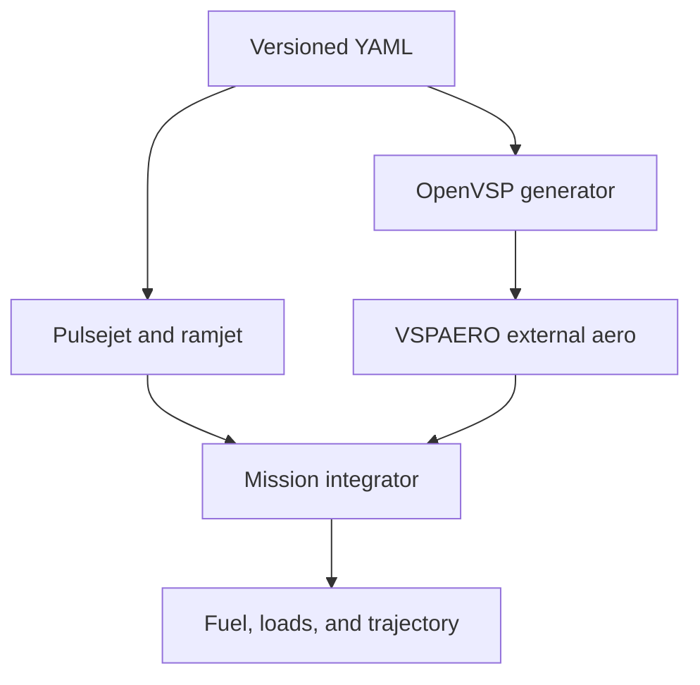

# Model architecture

## Discipline boundary

Python owns intake accounting, combustion, internal nozzle flow, thrust, fuel flow,
and flight dynamics. OpenVSP owns repeatable external geometry. VSPAERO owns inviscid
external forces and moments. No VSPAERO result is used as reacting internal flow or
as total drag without additional terms.

## Intake selector

The geometric rule is direct:

\[
A_{available}=f_{open}A_{circular},\qquad f_{open}=0.5.
\]

Discharge coefficient and total-pressure recovery are separate inputs. Pulsejet and
ramjet recovery values are also separate because the paths and operating Mach ranges
differ. Each is applied using the conventional definition
`Pt_recovered / Pt_ideal`; regression tests enforce that equation. This keeps the
user-defined half-area selector distinct from blockage and loss calibration.
`DualModePropulsion` enforces mutually exclusive modes.

## Pulsejet state and sequence

The pulsejet is a well-stirred, constant-volume control volume. State includes total
mass, fresh-air mass, unburned fuel, internal energy, pending heat release, and event
timing. Each step:

1. checks ignition pressure, refill, and minimum-period criteria;
2. schedules finite heat release for the burnable charge;
3. computes pressure-driven inlet flow from the recovered freestream reservoir;
4. computes instantaneous C-D-nozzle exhaust flow and gross thrust;
5. transports inlet/outlet enthalpy, heat release, and wall loss; and
6. recovers pressure and temperature from the lumped ideal-gas state.

The ledger implements

\[
\frac{dU}{dt}=\dot m_{in}h_{in}-\dot m_{out}h_{out}
              +\dot Q_{comb}-\dot Q_{rejected}.
\]

Inlet momentum drag is subtracted from gross nozzle thrust. Instantaneous values are
retained. Trade studies run through an explicit warmup and average only a later
measurement window so the initial precharged chamber cannot bias the result.

This mechanism produces the requested pressure rise, decay, refill, combustion, and
repeat behavior. It does not establish a self-excited acoustic mode, valve life,
flame stability, or distributed pressure loads.

## Shared fixed C-D nozzle

Both modes use the same configured throat and exit area. The quasi-one-dimensional
solver distinguishes:

- fully subsonic flow;
- a sonic throat with an internal normal shock; and
- a supersonic geometric exit.

For a supersonic exit,

\[
F_g=\dot m V_e+(p_e-p_a)A_e.
\]

The current Mach 1.10 total-pressure ratio strongly penalizes the earlier
`Ae/At = 2.25` placeholder. Candidate B therefore uses 1.05. The sensitivity remains
negative at that boundary, so 1.05 is an architecture bound to test—not a converged
interior optimum. Separation, shock/boundary-layer interaction, hysteresis, and
transient wave coupling remain outside the model.

## Ramjet and inlet spillage

The steady ramjet calculates potential capture, recovered total pressure, combustor
loss, fuel/air ratio, fixed-nozzle capacity, gross thrust, and inlet momentum drag.
If potential capture exceeds nozzle-compatible flow, excess flow is labeled spillage
and only the compatible portion enters thrust and fuel calculations.

That treatment prevents an undersized nozzle from accepting impossible mass flow,
but it is not a solved inlet. Candidate B is deliberately throat-limited and spills
about 50.5% of potential capture nominally. A coupled external/internal inlet analysis must show
where the terminal shock, separation, and spilled stream actually go.

Mach 0.80 light-off and Mach 1.10 self-sustaining gates remain separate. They are
configuration labels, not combustion-stability predictions.

## Design convergence calculation

The shared-nozzle trade combines:

- selector and nozzle radial packaging allowances;
- the prior drag-area budget scaled with body diameter squared;
- fixed-nozzle ramjet flow and a visible propulsion derate;
- startup-excluded pulsejet statistics;
- configured fuel allocation and a linear hold-throttle approximation; and
- mass and supersonic-duration requirement comparisons.

`design-convergence` holds altitude, Mach, area ratio, drag proxy, and component
assumptions fixed. It solves the minimum throat by reevaluating the ramjet through a
bisection root and derives the largest body that the derated thrust can support under
the diameter-squared drag proxy. These are local sensitivity bounds, not dimensional
tolerances.

`robustness-trade` adds a component mass reconciliation, named nominal/conservative/
adverse screens, and a visible weighted objective. Scenarios marked required are
hard gates before scoring. Candidate B passes the required conservative screen but
retains an explicit adverse-case failure. This remains a static peak-Mach screen.

## OpenVSP geometry

`openvsp_geometry.py` generates:

- five circular fuselage stations from the 195 mm open intake lip through the body to
  the shared nozzle exit;
- an OpenVSP flow-through engine surface with open inlet and outlet ends;
- two independently clocked minimal lifting surfaces; and
- four independently clocked fins in a 45-degree X arrangement.

Surface counts, clocking, planforms, tessellation, body transitions, allowances, and
analysis points all come from YAML. Generated `.vsp3` files stay ignored because
source parameters are authoritative.

The VSPAERO runner uses manual reference quantities derived from the exposed lifting
surfaces. The flight model uses the same 0.0896 m² area for Candidate B. Each
nonuniform Mach/alpha/beta combination runs as its own single point; this avoids
silently replacing the configured list with a linear start/end interpolation.

## Flight and total drag

The flight kernel is two-dimensional and point-mass. It preserves speed, flight-path
angle, altitude, downrange, and mass. The phase manager switches propulsion modes,
tracks fuel allocations, and records trajectory gates. A strict table adapter can
consume a complete live VSPAERO beta-zero table and rejects synthetic tables by
default.

Candidate B still uses the documented drag-area budget plus explicit spillage drag,
not live solver-backed coefficients. Its scalar trajectory closure therefore remains
an unvalidated numerical reference.

The intended total drag composition is

\[
D=q\left(C_{D,VSPAERO}S_{ref}+C_{D,viscous}S_{ref}
          +C_{D,wave}S_{ref}+C_{D,base}S_{ref}\right)
  +D_{inlet/spillage}.
\]

Terms may use other native reference areas internally, but they must be converted to
one documented drag area before coupling. The current `CdS` budget bypasses reference
coefficient ambiguity and remains in force until that accounting closes.
