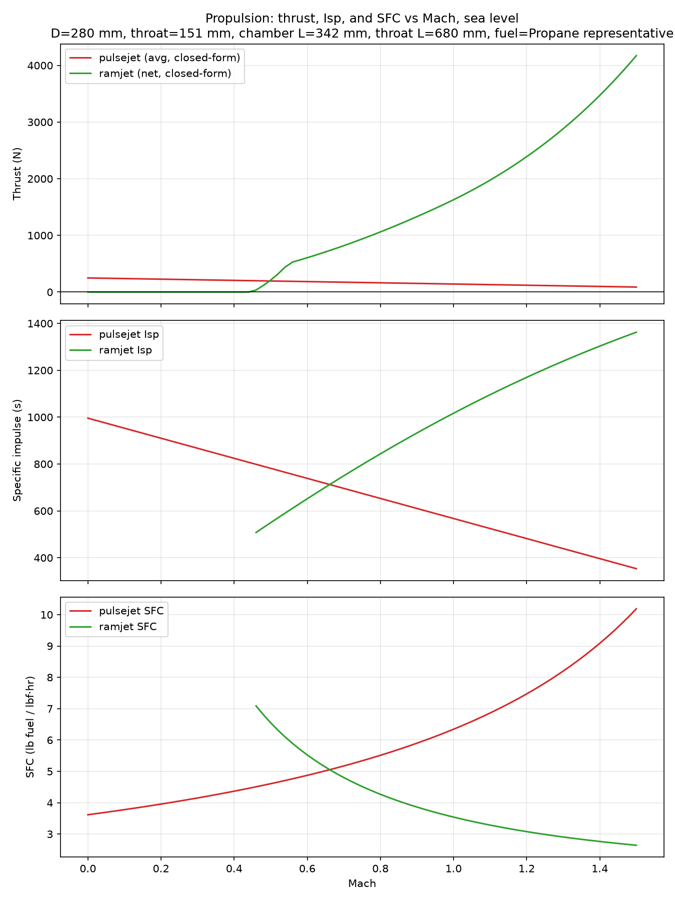
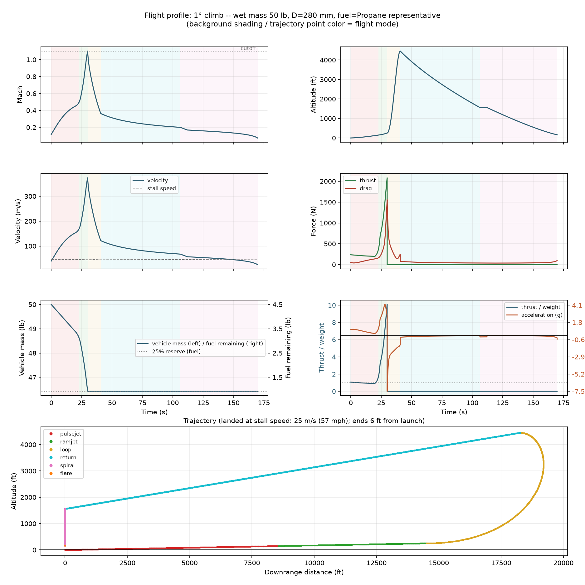

# v2 optimized vehicle + wing -- full parameter table

Campaign: CD0 = 0.1; composite objective (T/W + D + length + span)

| vehicle | value |
|---|---|
| body diameter | 280 mm |
| throat diameter | 151 mm (area frac 0.292) |
| chamber / tube length | 342 / 680 mm |
| nose cone / boattail length | 560 / 280 mm (2D / 1D) |
| overall body length (incl. nose/tail) | 1861 mm |
| climb angle / fuel | 1.0 deg / propane |

| wing concept | value |
|---|---|
| span | 654 mm |
| aspect ratio / taper / sweep | 1.96 / 0.78 / 9 deg |
| airfoil | Flat plate (sharp) |
| area / Oswald e / CLmax_eff | 0.217 m^2 / 0.828 / 0.78 |

| mass budget | kg |
|---|---|
| engine duct (steel, t=1.0 mm) | 4.89 |
| airframe skin (CFRP) | 5.30 |
| wing | 1.30 |
| avionics / tank hw / landing hw | 2.0 / 0.80 / 0.5 |
| dry total | 14.80 |
| fuel loaded (incl. reserve) | 2.03 |
| payload/ballast margin vs 50 lb | 5.85 |

| mission | value |
|---|---|
| peak T/W | 10.08 |
| composite score | 1.785 |
| min powered thrust margin | 1.36 at M 1.10 (required >= 1.15) |
| min powered acceleration | 0.26 g at M 0.45 (required >= 0.25 g) |
| cutoff / safe landing | True / True |
| touchdown / stall speed | 25 / 45 m/s |
| flight time / ground track | 170 s / 11.7 km (lands 2 m from launch) |

## Plots

### Propulsion (thrust, Isp, SFC vs Mach; sea level)

### Flight profile (time histories incl. fuel remaining + trajectory; shading = flight mode)

