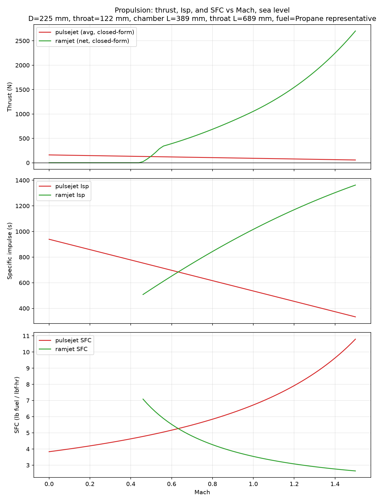
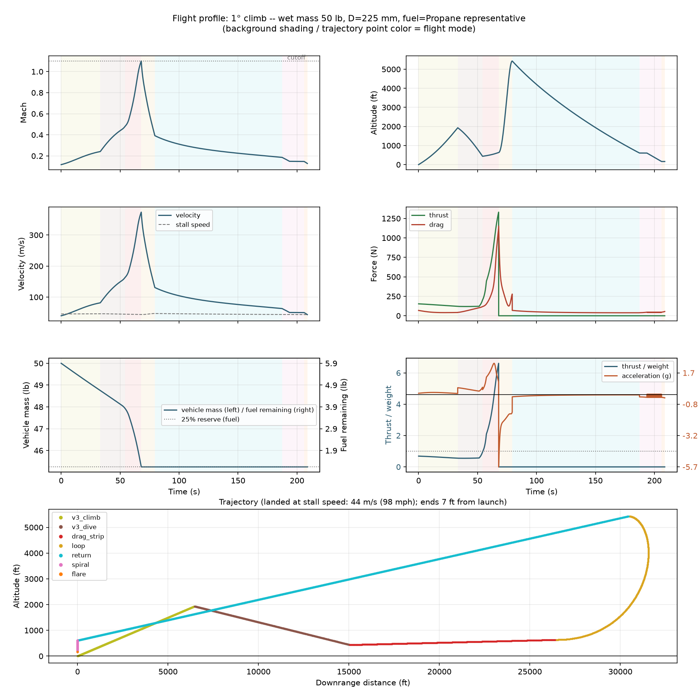

# V3 climb-dive design -- full parameter table

Campaign: CD0 = 0.1; climb-dive profile; acceleration gate 0.25 g on the traverse (notch + drag strip).

## Trajectory

| phase | value |
|---|---|
| initial climb angle | 16.7 deg |
| top of climb (DERIVED from the dive) | 1933 ft |
| dive angle | 9.9 deg |
| pull-out floor | 437 ft (hard min 400 ft) |
| drag-strip angle | 1.0 deg |
| rule (gamma >= 0, M 0.80 -> cutoff) | SATISFIED |

## Vehicle

| parameter | value |
|---|---|
| body diameter | 225 mm |
| throat diameter | 122 mm (area frac 0.292) |
| chamber / tube length | 389 / 689 mm |
| nose cone / boattail length | 450 / 225 mm |
| overall body length | 1754 mm |
| fuel | propane |

| wing concept | value |
|---|---|
| span | 533 mm |
| aspect ratio / taper / sweep | 1.86 / 0.51 / 13 deg |
| airfoil | Thin cambered plate |

| mass budget | kg |
|---|---|
| engine duct (steel, t=1.0 mm) | 4.23 |
| airframe skin (CFRP) | 4.02 |
| wing | 0.91 |
| avionics / tank hw / landing hw | 2.0 / 0.90 / 0.5 |
| dry total | 12.57 |
| fuel loaded (incl. reserve) | 2.69 |
| payload/ballast margin vs 50 lb | 7.42 |

| mission | value |
|---|---|
| peak T/W | 6.61 |
| min traverse acceleration | +0.261 g at M 0.45 (required >= 0.25) |
| min acceleration incl. climb | +0.074 g at M 0.24 (must stay > 0) |
| min engine-only thrust margin | 1.15 at M 0.24 (required >= 1.15) |
| cutoff / safe landing | True / True |
| touchdown / stall speed | 44 / 44 m/s |
| flight time / ground track | 209 s / 19.2 km (lands 2 m from launch) |

## Plots

### Propulsion (thrust, Isp, SFC vs Mach; sea level)

### Flight profile (climb / dive / drag strip / return; shading = phase)

