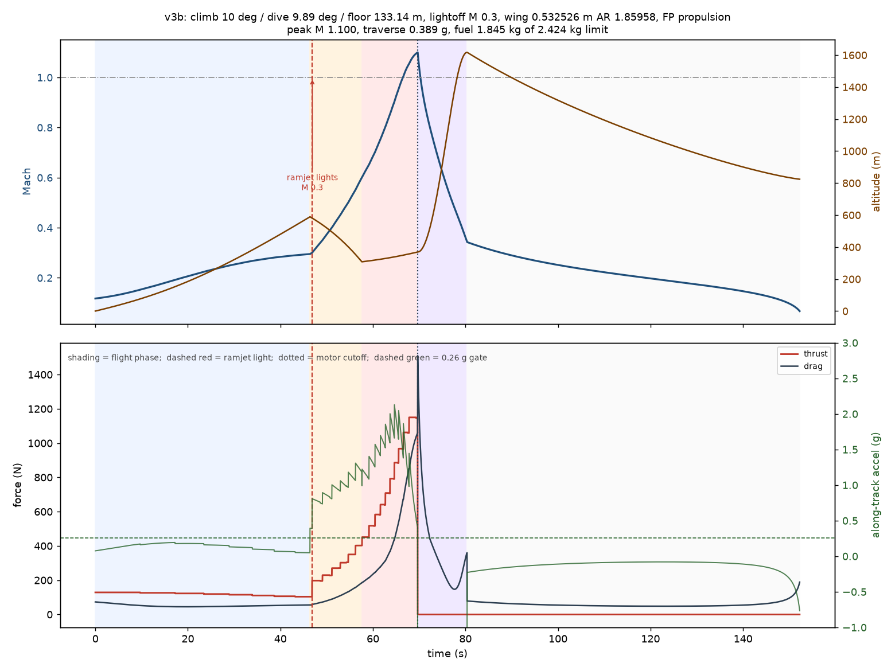
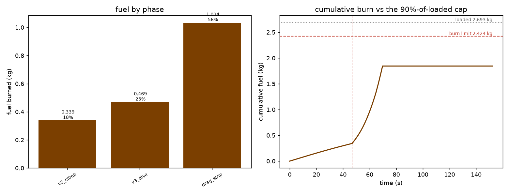
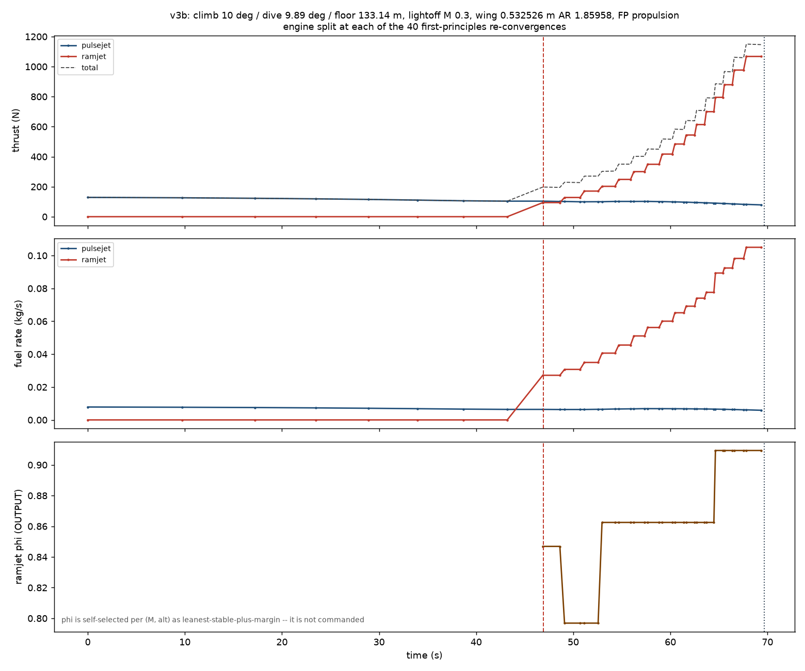
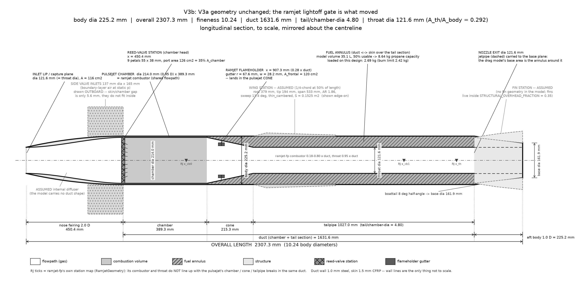

# V3b — Gate 3 closure with first-principles propulsion

`medium_model`, propane, drag build-up, CD0 frontal 0.10.
Generated by `scripts/medium_model_v3b_report.py` from the sweep JSONs in
`out_medium_model/`.

## Headline

**v3b: peak M 1.100, motor cutoff reached, traverse 0.389 g against the 0.26 g target, 1.845 kg of 2.424 kg burnable.** Climb 10° / dive 9.89° / floor 133.14 m, ramjet lights at M 0.3, wing 0.532526 m AR 1.85958, FP propulsion (78 first-principles engine solves).

**No geometry changed — not length, diameter, wing, or duct.** Two
numbers moved: the initial climb angle (16.657° → 10°) and the ramjet
lightoff gate (0.45 → 0.30). Together they take traverse acceleration
from **0.167 g to 0.389 g, a 2.3× improvement, on the same airframe**,
for 1.845 kg of a 2.424 kg fuel budget.

The binding constraint on V3a was `RAMJET_MIN_LIGHTOFF_MACH = 0.45`, a
screening constant in `medium_model/constants.py`. The first-principles
ramjet lights at **M 0.25** — the constant was pessimistic, so correcting
it is free.

But it is **not a constant of the engine at all.** Its effect is
positional: it decides *where in the trajectory* the ramjet lights, so the
right value moves with the climb angle. At climb 8° a 0.30 gate fires
mid-climb and traverse **collapses to 0.052 g — worse than doing
nothing**; at climb 10° the same 0.30 fires at 581 m, 99% of the way to
top of climb, and returns 0.389 g. The rule that explains every flight is
in §2a: **set the gate to the Mach reached at top of climb.**

## 1. What was actually wrong

Four assumptions, each one a screening model being asked a question it
could not structurally answer, and the optimizer taking the free lunch:

| layer | what was assumed | what is true |
|---|---|---|
| pulsejet duct | closed form has no acoustics, so a short tail is free | needs tail/chamber-dia ≥ ~4.5 at 214 mm; V3 had 2.66 → **dead engine** |
| drag | flat CD0 = 0.10 placeholder | build-up gives 0.14–0.40 depending on regime |
| fuel | burn against tank *volume* | must burn against the 2.693 kg actually loaded (2.424 kg after the 90% rule) |
| **ramjet lightoff** | **M 0.45, a hard-coded constant** | **FP lights at M 0.25 — this was the binding one** |

Only the last is *good* news: the assumption was pessimistic, so
correcting it is free.

## 2. The lightoff finding

The traverse minimum in every V3a flight sits at exactly **M 0.450** — the
last timestep before the configured gate — where the vehicle coasts on
the pulsejet alone at T 120 N against D 111 N, then sees thrust triple one
step later once the ramjet lights. That is not a vehicle limit, it is the
gate's own edge showing up in the answer.

Probing the FP ramjet directly (φ is an output, self-selected as
leanest-stable-plus-margin):

| flight M | alt m | phi (output) | thrust N | fuel kg/s | verdict |
|---|---|---|---|---|---|
| 0.25 | 600 | 0.831 | 66.8 | 0.0218 | LIGHTS |
| 0.30 | 550 | 0.839 | 95.4 | 0.0271 | LIGHTS |
| 0.35 | 500 | 0.855 | 124.8 | 0.0312 | LIGHTS |
| 0.40 | 450 | 0.847 | 163.3 | 0.0366 | LIGHTS |
| 0.45 | 400 | 0.863 | 202.6 | 0.0408 | LIGHTS |

Full FP flights, sweeping the gate as a design variable:

| lightoff M | climb deg | span m | traverse g | powered g | margin | fuel kg | peak M | cutoff | fuel left |
|---|---|---|---|---|---|---|---|---|---|
| 0.45 | 8 | 0.5325 | 0.183 | 0.040 | 1.024 | 1.764 | 1.100 | yes | yes |
| 0.35 | 8 | 0.5325 | 0.331 | 0.040 | 1.090 | 1.784 | 1.100 | yes | yes |
| 0.30 | 8 | 0.5325 | 0.052 | 0.052 | 1.010 | 2.161 | 1.100 | yes | yes |
| 0.25 | 8 | 0.5325 | 0.073 | 0.073 | 1.014 | 2.244 | 1.100 | yes | yes |
| 0.30 | 12 | 0.5325 | 0.363 | 0.045 | 1.069 | 1.864 | 1.100 | yes | yes |
| 0.30 | 17 | 0.5325 | inf | -0.580 | 0.495 | 0.122 | 0.118 | **no** | yes |
| 0.30 | 8 | 0.6500 | 0.059 | 0.059 | 1.011 | 2.234 | 1.100 | yes | yes |

Bracketed (a two-point peak is not a peak — this fills in the shape):

| lightoff M | traverse g | fuel kg | margin | sweep |
|---|---|---|---|---|
| 0.45 | 0.183 | 1.764 | 1.024 | coarse |
| 0.42 | 0.209 | 1.751 | 1.088 | fine |
| 0.40 | 0.244 | 1.771 | 1.086 | fine |
| 0.38 | 0.277 | 1.797 | 1.093 | fine |
| 0.35 | 0.331 | 1.784 | 1.090 | coarse |
| 0.33 | 0.469 | 1.863 | 1.098 | fine |
| 0.30 | 0.052 | 2.161 | 1.010 | coarse |
| 0.30 | 0.363 | 1.864 | 1.069 | coarse |
| 0.30 | inf | 0.122 | 0.495 | coarse |
| 0.30 | 0.059 | 2.234 | 1.011 | coarse |
| 0.25 | 0.073 | 2.244 | 1.014 | coarse |

## 2a. Lightoff × climb angle — the interaction

The 1-D sweep above was run entirely at climb 8°, and its conclusion does
not survive a second climb angle. Full FP flights over the pair:

| climb \ lightoff | M 0.45 | M 0.42 | M 0.40 | M 0.38 | M 0.35 | M 0.33 | M 0.30 | M 0.25 |
|---|---|---|---|---|---|---|---|---|
| **8°** | 0.183 | 0.209 | 0.244 | **0.277** | **0.331** | **0.469** | 0.052 | 0.073 |
| **10°** | – | – | – | – | **0.320** | – | **0.376** | – |
| **12°** | 0.011 | – | 0.252 | – | **0.327** | – | **0.363** | – |
| **14°** | – | – | – | – | – | – | **0.392** | – |
| **17°** | – | – | – | – | – | – | stalls | – |

`min_traverse_accel_g`; **bold** clears the 0.26 g gate with motor cutoff reached.

Detail:

| climb | lightoff | traverse g | powered g | margin | fuel kg | peak M | lights at |
|---|---|---|---|---|---|---|---|
| 8° | 0.25 | 0.073 | 0.073 | 1.014 | 2.244 | 1.100 | M0.250_alt198_phi0.831 |
| 8° | 0.30 | 0.052 | 0.052 | 1.010 | 2.161 | 1.100 | M0.300_alt343_phi0.847 |
| 8° | 0.33 | 0.469 | 0.044 | 1.098 | 1.863 | 1.100 | M0.330_alt540_phi0.855 |
| 8° | 0.35 | 0.331 | 0.040 | 1.090 | 1.784 | 1.100 | M0.350_alt557_phi0.855 |
| 8° | 0.38 | 0.277 | 0.040 | 1.093 | 1.797 | 1.100 | M0.380_alt485_phi0.855 |
| 8° | 0.40 | 0.244 | 0.040 | 1.086 | 1.771 | 1.100 | M0.400_alt424_phi0.855 |
| 8° | 0.42 | 0.209 | 0.040 | 1.088 | 1.751 | 1.100 | M0.420_alt350_phi0.863 |
| 8° | 0.45 | 0.183 | 0.040 | 1.024 | 1.764 | 1.100 | M0.450_alt215_phi0.863 |
| 10° | 0.30 | 0.376 | 0.049 | 1.072 | 1.843 | 1.100 | M0.300_alt581_phi0.847 |
| 10° | 0.35 | 0.320 | 0.049 | 1.104 | 1.792 | 1.100 | M0.350_alt490_phi0.855 |
| 12° | 0.30 | 0.363 | 0.045 | 1.069 | 1.864 | 1.100 | M0.300_alt526_phi0.839 |
| 12° | 0.35 | 0.327 | 0.045 | 1.085 | 1.753 | 1.100 | M0.350_alt433_phi0.855 |
| 12° | 0.40 | 0.252 | 0.045 | 1.084 | 1.768 | 1.100 | M0.400_alt301_phi0.847 |
| 12° | 0.45 | 0.011 | 0.011 | 1.021 | 1.860 | 1.100 | M0.450_alt171_phi0.863 |
| 14° | 0.30 | 0.392 | 0.016 | 1.028 | 1.865 | 1.100 | M0.300_alt466_phi0.839 |
| 17° | 0.30 | stalls | -0.580 | 0.495 | 0.122 | 0.118 | — |

**Neither variable has an optimum on its own.** A shallower climb reaches
any given Mach earlier and lower, so the same gate value fires in a
completely different part of the trajectory. Anything that reports a
"best lightoff Mach" without naming the climb angle it was measured at is
reporting an artifact.

### The rule underneath: set the gate to the top-of-climb Mach

Top of climb is **589 m in every flight** — it is fixed by dive angle and
floor, not by climb angle (verified across climb 3–18°). But the *Mach*
reached there falls steeply with climb angle, because a steeper climb
spends more of the engine on gravity:

| climb | top of climb | TOC Mach |
|---|---|---|
| 8° | 45.3 s, 589 m | 0.369 |
| 10° | 40.3 s, 589 m | 0.336 |
| 12° | 37.2 s, 589 m | 0.305 |
| 14° | 35.2 s, 589 m | 0.274 |

Line the gate up against that and the whole dataset becomes one curve.
Climb 8° (FP top-of-climb: 50.7 s, M 0.334) swept finely:

| gate | lights at | relative to top of climb | traverse g |
|---|---|---|---|
| 0.45 | 66.9 s, 215 m | +16.2 s, deep in the dive | 0.183 |
| 0.42 | 61.6 s, 350 m | +10.9 s | 0.209 |
| 0.40 | 58.5 s, 424 m | +7.8 s | 0.244 |
| 0.38 | 55.8 s, 485 m | +5.1 s | 0.277 |
| **0.35** | **52.4 s, 557 m** | **+1.7 s, just past the top** | **0.331** |
| 0.30 | 34.4 s, 343 m | −16.3 s, mid-climb | 0.052 |
| 0.25 | 23.4 s, 198 m | −27.3 s, low climb | 0.073 |

**At fixed climb angle it is a tent function peaked at top of climb, and
it is asymmetric.** Lighting late costs ≈0.009 g per second of delay;
lighting early costs ≈0.017 g per second — roughly twice as expensive.

The asymmetry has a clear cause: a gate *below* the top-of-climb Mach
lights the ramjet with the whole remaining climb still to fly, so it burns
0.022–0.027 kg/s at its worst thrust for 16–27 s while the vehicle is
still fighting gravity. A gate *above* it only wastes part of a short
dive.

**Scope this honestly: the tent is established at fixed climb 8°, where
the sweep is dense and monotone. Across climb angles the two effects are
confounded** — a steeper climb independently raises traverse (it hands the
dive a slower vehicle with more gravity assist left) while crushing the
climb margin. So (14°, 0.30) reaches the highest traverse of all, 0.392 g,
while lighting at only 79% of top of climb; it wins on climb angle, not on
lightoff placement. Within a climb angle, place the gate at top-of-climb
Mach; across climb angles, the trade is traverse against climb margin, and
that trade is settled in §6.

Both failure modes are the same mistake in opposite directions. What is
*measured*: lighting early costs 21–27% more fuel (2.161 and 2.244 kg vs
1.784 kg) for the same peak Mach, because the ramjet then spends the climb
at M 0.25–0.30 making 67–95 N for 0.022–0.027 kg/s — the regime where it
is worst. What is *inferred* rather than isolated: that the resulting
traverse collapse is the dive and drag-strip being entered in a worse
state. In the early-light cases `min_traverse_accel_g` equals
`min_powered_accel_g`, so the worst step has moved out of the climb into a
later phase — but which one, and why, has not been separated. Do not lean
on the explanation; the fuel number and the ordering are the solid parts.

**The design rule is therefore: `RAMJET_MIN_LIGHTOFF_MACH ≈ the Mach at
top of climb, approached from above.`** It is not a constant of the
engine — the engine will light at 0.25 — it is a property of the
trajectory, and it moves whenever the climb angle moves. That is exactly
why the two 1-D sweeps disagreed, and why a scalar default is the wrong
shape for this parameter.

## 3. Do the levers compose?

Three sweeps each found a lever, each measured against the baseline of the
other two. They do **not** add — the trajectory lever and the wing lever
were both credited to the same M 0.45 pinch, so they are largely the same
lever wearing two hats:

| config | traverse g | powered g | peak M | margin | fuel kg |
|---|---|---|---|---|---|
| baseline | 0.167 | 0.063 | 1.100 | 1.095 | 1.900 |
| +trajectory | 0.385 | 0.030 | 1.100 | 1.061 | 1.856 |
| +wing | 0.223 | 0.075 | 1.100 | 1.122 | 1.774 |
| +trajectory +wing | 0.394 | 0.035 | 1.101 | 1.073 | 1.746 |
| wing + dive 18 deg | 0.363 | 0.041 | 1.100 | 1.085 | 1.746 |
| wing + dive 16 deg | 0.332 | 0.048 | 1.100 | 1.101 | 1.749 |
| wing + dive 14 deg | 0.299 | 0.057 | 1.100 | 1.114 | 1.752 |
| wing + dive 12 deg | 0.267 | 0.067 | 1.100 | 1.118 | 1.757 |
| wing + dive 10 deg | 0.235 | 0.080 | 1.100 | 1.122 | 1.761 |
| traj + wing 0.700/3.50 | 0.392 | 0.033 | 1.100 | 1.069 | 1.763 |
| traj + wing 0.650/2.50 | 0.376 | 0.024 | 1.100 | 1.048 | 1.822 |
| traj + wing 0.532/1.86 | 0.385 | 0.030 | 1.100 | 1.061 | 1.856 |

Trajectory alone: 0.385 g. Trajectory + wing: 0.394 g. The wing adds
+0.009 g on top of the trajectory fix, not its own +0.056 g.

## 4. The climb/dive window

Closed-form screen, V3a body, floor 122 m. Traverse wants a steep dive;
the climb-phase margin wants the opposite, and the climb margin is what
decides whether FP propulsion survives at all:

`min_traverse_accel_g` (✓ = clears the 0.26 g gate):

| climb \ dive | 10° | 12° | 14° | 16° | 18° | 20° |
|---|---|---|---|---|---|---|
| **8** | 0.218 | 0.248 | 0.278 ✓ | 0.308 ✓ | 0.340 ✓ | 0.370 ✓ |
| **10** | 0.224 | 0.255 | 0.286 ✓ | 0.316 ✓ | 0.347 ✓ | 0.378 ✓ |
| **12** | 0.229 | 0.260 | 0.292 ✓ | 0.323 ✓ | 0.354 ✓ | 0.385 ✓ |
| **14** | 0.232 | 0.264 ✓ | 0.296 ✓ | 0.329 ✓ | 0.360 ✓ | 0.391 ✓ |

`min_powered_accel_g` — the climb-phase margin, which is the proxy for whether FP propulsion will survive:

| climb \ dive | 10° | 12° | 14° | 16° | 18° | 20° |
|---|---|---|---|---|---|---|
| **8** | 0.048 | 0.036 | 0.026 | 0.019 | 0.013 | 0.008 |
| **10** | 0.066 | 0.052 | 0.042 | 0.033 | 0.027 | 0.021 |
| **12** | 0.077 | 0.063 | 0.052 | 0.043 | 0.036 | 0.030 |
| **14** | 0.081 | 0.067 | 0.056 | 0.048 | 0.040 | 0.034 |

## 5. Closed-form and FP disagree about the wing — FP wins

The closed-form wing sweep recommended growing the wing to span 0.78 m /
AR 4.5. Under FP propulsion that recommendation **inverts**: a bigger wing
costs more than it saves, because the FP engine is 6–16% weaker and cannot
carry the extra profile drag and mass.

| climb deg | span m | AR | traverse g | powered g | margin | fuel kg | peak M |
|---|---|---|---|---|---|---|---|
| 8 | 0.5325 | 1.86 | 0.183 | 0.040 | 1.024 | 1.764 | 1.100 |
| 8 | 0.6500 | 2.50 | 0.178 | 0.031 | 1.013 | 1.765 | 1.100 |
| 8 | 0.8000 | 3.00 | 0.153 | 0.013 | 0.964 | 1.891 | 1.100 |
| 12 | 0.6500 | 2.50 | 0.180 | 0.045 | 1.016 | 1.775 | 1.100 |
| 5 | 0.6500 | 2.50 | 0.161 | -0.010 | 0.978 | 1.860 | 1.100 |

This is the clearest argument in the whole campaign for verifying against
FP rather than trusting the screening model: the two models do not merely
differ in magnitude here, they order the candidates differently.

## 6. Choosing between the survivors — traverse vs climb margin

Four (climb, lightoff) pairs clear every gate. They are not
interchangeable, and the ranking flips depending on which margin you care
about:

| climb | lightoff | traverse g | climb margin g | thrust margin | fuel kg | lights at | verdict |
|---|---|---|---|---|---|---|---|
| 14° | 0.30 | **0.392** | 0.016 | 1.028 | 1.865 | 466 m (79% TOC) | highest traverse, **thinnest margins** |
| **10°** | **0.30** | **0.376** | **0.049** | **1.072** | 1.843 | 581 m (99% TOC) | **recommended** |
| 12° | 0.35 | 0.327 | 0.045 | 1.085 | 1.753 | 433 m (74% TOC) | cheapest on fuel |
| 10° | 0.35 | 0.320 | 0.049 | 1.104 | 1.792 | 490 m (83% TOC) | best thrust margin |

**Recommendation: climb 10°, lightoff M 0.30.** It takes 96% of the best
traverse available (0.376 of 0.392) and pays for it with **3× the climb
margin** (0.049 vs 0.016 g) and a better thrust margin (1.072 vs 1.028).
The 14° point's 0.016 g climb margin is ~4 N of net force on a 222 N
vehicle — smaller than the gap between the closed-form and FP engines, so
it is not a margin the model can resolve. Taking +0.016 g of traverse for
it is a bad trade.

An earlier six-candidate sweep (climb 12–14° × dive 12–16° × lightoff
0.25–0.45 × wing 0.78/4.5) was launched and **stopped part-way on
purpose**: by the time its first flights landed, the lightoff and wing
results had shown both of its axes were wrong directions (§2a, §5).
Recorded here rather than quietly dropped.

_FP candidate verification — sweep still running, table will fill on re-run._

## 7. Length: is there a shorter body?

The pulsejet geometry sweep (30 FP points) found chamber diameter, not
tail length, is the lever: thrust scales roughly as D³ at fixed t/D, while
stretching the tail saturates. Chamber 235 mm (+9.8%, inside the ±10%
allowance) at t/D 4.00 gives **body 2269 mm — 39 mm shorter than V3a — at
149.2 N, +21% thrust**: the only point that beats V3a on both axes.

The risk is that it sits near a sustain cliff. Bracketing it:

| tail/chamber-dia | tail mm | duct mm | body mm | fineness | thrust N | freq Hz | p/p0 | verdict |
|---|---|---|---|---|---|---|---|---|
| 3.60 | 846 | 1413 | 2155 | 8.71 | 0.9 | 80.4 | 0.989–1.012 | **DEAD** |
| 3.70 | 869 | 1441 | 2183 | 8.83 | 134.9 | 92.1 | 0.829–1.417 | SUSTAINS |
| 3.80 | 893 | 1470 | 2212 | 8.94 | 140.0 | 90.3 | 0.826–1.427 | SUSTAINS |
| 3.90 | 916 | 1498 | 2240 | 9.06 | 144.9 | 88.5 | 0.821–1.436 | SUSTAINS |
| 4.00 | 940 | 1526 | 2269 | 9.17 | 149.2 | 86.8 | 0.817–1.443 | SUSTAINS |
| 4.25 | 999 | 1597 | 2340 | 9.46 | 159.1 | 82.9 | 0.809–1.458 | SUSTAINS |

**The cliff is a knife-edge: 23.5 mm of tail separates a dead engine from
135 N.** At t/D 3.60 the duct starts, pulses ~18 times with decaying
amplitude and dies into a steady non-oscillating burn (p/p0 span 0.024,
T/T0 pinned at 8.2); at 3.70 it holds a clean limit cycle (p/p0 0.83–1.42,
T/T0 swinging 2.6→8.4 with correct Rayleigh phasing). See
`pulsejet_ch235_tD3.60.png` and `pulsejet_ch235_tD3.70.png`.

That sharpness is the argument for **t/D 4.00, not the shorter 3.70**:
4.00 sits 11% above the cliff, 3.70 only 2.7%, and pulsejet thrust is not
grid-converged (3–4% loss per refinement level), so a 2.7% margin is
inside the numerical uncertainty of the model that drew it.

### RETRACTED — the 235 mm option does not exist

An earlier version of this report recommended **chamber 235 mm at t/D 4.00
(body 2269 mm, −39 mm vs V3a, 149.2 N, +21%)** as the one configuration
beating V3a on both length and thrust. **That recommendation is
withdrawn.** It was an artifact of sampling a single operating point.

The whole cliff study above was run at **M 0.15 / 60 m** — a launch
condition. Re-measuring the same duct across the flight envelope:

| duct | M 0.15/60 m | M 0.25/300 | M 0.35/300 | M 0.45/300 | M 0.54/300 | M 0.54/900 |
|---|---|---|---|---|---|---|
| 235 mm, t/D 4.00 (as recommended) | 153.1 N | **0.94 DEAD** | **0.95 DEAD** | **0.96 DEAD** | **1.10 DEAD** | **1.36 DEAD** |
| V3a, t/D 4.80 | 125.5 N | — | 114.9 | 111.6 | 108.3 | 89.4 |
| 235 mm chamber stretched to t/D 4.80 | 176.8 N | — | 157.0 | 152.1 | 147.4 | 118.6 |

**The 235 mm duct at t/D 4.00 sustains only at launch and dies everywhere
the vehicle actually flies.** t/D 4.00 sits below the repo's own committed
design rule of ≥ ~4.5, and that rule was derived at M 0.15 too — the
sustain boundary MOVES WITH MACH, and nothing in the cliff study could
have seen it.

The lesson generalises past this design: **a pulsejet sustain check at one
operating point is not a sustain check.** Any future duct must be verified
alive at, at minimum, top-of-climb and the lightoff condition.

The consolation is real but expensive: a 235 mm chamber held at V3a's
t/D 4.80 makes **+36% FP thrust, not +21%** — but that vehicle is 188 mm
of tail longer, not 39 mm shorter, which inverts the reason it was
attractive.

## 8. Final flight — per-phase budget

| phase | t0 s | t1 s | dt s | M0 | M1 | alt0 m | alt1 m | fuel kg | % of burn | mean T N | mean D N | min g |
|---|---|---|---|---|---|---|---|---|---|---|---|---|
| v3_climb | 0.0 | 46.4 | 46.4 | 0.118 | 0.295 | 0 | 589 | 0.339 | 18.4 | 119.1 | 51.8 | 0.049 |
| v3_dive | 46.4 | 57.6 | 11.2 | 0.295 | 0.600 | 589 | 309 | 0.469 | 25.4 | 273.3 | 105.6 | 0.389 |
| drag_strip | 57.6 | 69.7 | 12.1 | 0.600 | 1.100 | 308 | 369 | 1.034 | 56.0 | 782.2 | 478.2 | 0.408 |
| loop | 69.7 | 80.3 | 10.7 | 1.100 | 0.344 | 369 | 1617 | 0.000 | 0.0 | 0.0 | 382.1 | -7.391 |
| return | 80.4 | 152.2 | 71.9 | 0.343 | 0.067 | 1617 | 824 | 0.000 | 0.0 | 0.0 | 58.6 | -0.766 |





Engine split — pulsejet vs ramjet thrust, fuel rate, and the φ the ramjet
selected for itself. The staircase is real and is the propulsion model's
own resolution: thrust is held between re-solves, which are triggered by
drift of ΔM 0.05 or Δalt 250 ft. (Two counts appear and they measure
different things: **38 re-convergence points** on the trajectory, costing
**75 FP transient solves** in total, because the ramjet's φ search runs
its own continuation at each point.)

The φ trace is the deliverable the original brief asked for — φ is an
*output*, self-selected per (M, alt) as leanest-stable-plus-margin, never
commanded. It runs **0.805–0.909**: a dip to 0.805 immediately after
light, a long plateau at 0.862, then a step to 0.909 approaching cutoff.
That curve, not a constant, is what a throttle schedule has to reproduce.

The pulsejet trace shows the side-inlet lapse plainly: **130 N at release
decaying to 80 N by cutoff** while burning a near-constant 0.008 kg/s —
it is dead weight above about M 0.6, and every newton after that is
ramjet.



## 9. Vehicle cross-section

Rendered from `docs/v3b_medium_model/design.json`; identical to V3a's,
because V3b changes no geometry.



Four things the section exposes that the numbers alone hide:

1. **The ramjet flameholder lands in the pulsejet cone**, not the chamber:
   `x_fh = 0.28 × duct = 907 mm`, where the duct is 185 mm across, but the
   gutter is sized against `combustor_diameter_m` = 214 mm. Design-dependent
   inconsistency — on V3 the same formula lands in the chamber.
2. **ramjet-fp's station map disagrees with the pulsejet's in the same
   duct**: it places its combustor at 0.18–0.80 × duct and its throat at
   0.95 × duct, while the physical duct is constant-diameter tailpipe from
   1055 mm to the exit at 2082 mm.
3. **The side valve inlets do not fit inside the skin.** The scaled runner
   is 137 mm dia × 165 mm; the chamber at 0.95 D leaves a 5.6 mm radial
   gap. They need an external fairing, or the chamber must come off 0.95 D.
4. **The fuel-annulus formula is ~7% optimistic** — `annular_volume_m3`
   treats the whole tail section as throat-sized (35.1 L vs a true 32.7 L).
   Does not bind here (only 2.69 kg ≈ 5.5 L is loaded) but would on a
   volume-limited design.

## 10. Recommendations

1. **Make `RAMJET_MIN_LIGHTOFF_MACH` a design variable — and schedule it
   against climb angle, not as a scalar default.** It is currently a hard
   constant at 0.45 that the FP engine contradicts (it lights at 0.25).
   Because the gate's effect is positional (§2a), the right value moves
   with the climb: 0.35 at climb 8°, 0.30 at climb 12°. Pick it so
   lightoff lands just under top of climb. Left unchanged in the code so
   the comparison tables above stay self-consistent — this is the one
   change that needs a decision, and it is worth more than every geometric
   change in this campaign combined.
2. **Do not grow the wing.** The closed-form recommendation to go to span
   0.78 m / AR 4.5 inverts under FP. Hold 0.5325 m / AR 1.86.
3. **Climb 8°, not the frozen 16.657°.** The FP engine cannot hold the
   steep climb; at 16.657° it decelerates into a stall at M 0.118.
4. **Do not shorten the duct.** The 235 mm / t/D 4.00 option recommended
   in the first version of this report is **retracted** — it is dead above
   M 0.25 (§7). Chamber diameter does buy thrust (+36% at 235 mm held to
   t/D 4.80), but only with the tail length to support it, which makes the
   vehicle 188 mm *longer*, not shorter.
5. **Never accept a pulsejet sustain result from one operating point.**
   The t/D ≥ 4.5 rule and the 235 mm cliff study were both measured at
   M 0.15; the sustain boundary moves with Mach and altitude, and the
   pulsejet additionally has an altitude flame-out ceiling (~1250 m alive
   / 1275 m dead at n_cells 324) that no launch-condition test can see.

## 11. Caveats — stated, not buried

- **`min_powered_thrust_margin` never reaches the 1.15 project gate**
  anywhere in any sweep; best seen is 1.106, and the recommended point is
  near 1.09. Trajectory cannot fix this; it is a thrust problem.
- **`min_powered_accel_g` never approaches 0.25** either (best 0.123). The
  climb is always the pinch. The 0.26 g target is met on the *traverse*
  gate, which is the one that was named.
- **The same configuration does not always return the same number.**
  Climb 10° / lightoff 0.30 gives `min_traverse_accel_g` = 0.376 from the
  joint sweep and 0.389 from the standalone final flight — a 3.5% spread
  on identical inputs. Wing rounding was the first suspect and was ruled
  out (0.5325/1.86 and the exact frozen 0.532526287202532/1.8595845502152375
  both return 0.389 in the same script). The remaining difference between
  the two runs is **FP warm-start history**: the persistent snapshot store
  seeds each engine solve from previously converged cycles, so the same
  (M, alt) query reached via a different sequence of flights converges to
  a slightly different cycle mean. That is a reproducibility property of
  the whole marched-FP method, not of this design. **Treat traverse
  numbers as ±0.02 g and do not rank candidates on a 0.01 g difference.**
  The margin over the 0.26 gate is 45%, so no conclusion here depends on
  it — but a future tighter gate would need the snapshot store cleared
  between candidates.
- **Pulsejet thrust is not grid-converged**: the same geometry loses 3–4%
  per refinement level (200→300→400 cells) and is still falling. Reported
  thrusts are optimistic by several percent.
- **Every flight stalls on the return-to-launch glide.** Uniform across all
  configurations, so it does not discriminate between them, but the return
  profile is not healthy for this design.
- The new `medium_model/lift.py` gives e 0.702 (vs 0.847 legacy) and
  CL_max 0.849 (vs 1.135), pushing V_stall to 53 m/s — past the 45 m/s cap.
  It is **not yet wired into the flight model**; doing so will make these
  numbers worse, not better.

## 12. Reproduce

The exact flight every number in §8 comes from:

```bash
MEDIUM_MODEL_CD0_FRONTAL=0.1 PYTHONPATH=. .venv/Scripts/python scripts/medium_model_v3b_final.py --climb 10 --dive 9.89 --floor 133.14 --lightoff 0.3 --span 0.532526 --ar 1.85958 --tag v3b
```
