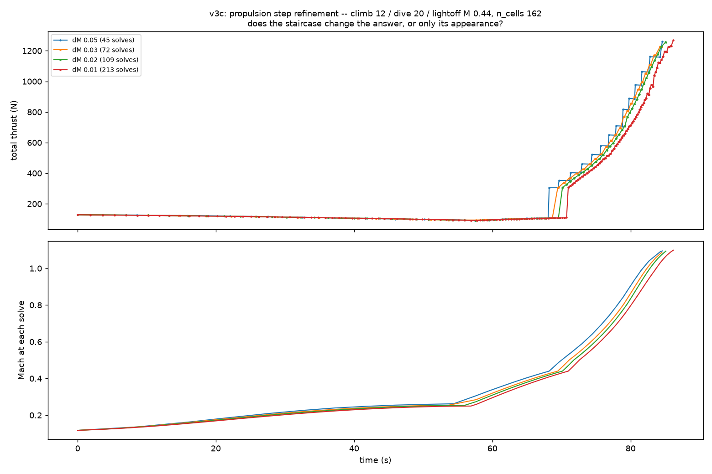

# V3c — the latest possible ramjet ignition

`medium_model`, propane, drag build-up, CD0 frontal 0.10, V3a airframe
unchanged. Generated by `scripts/medium_model_v3c_report.py`.

## Headline

**The latest ramjet ignition that closes Gate 3 at CONFIRM fidelity is M 0.40** — 33% later in Mach than V3b's 0.30. Flown at climb 8° / dive 14° / floor 122 m on the unchanged V3a airframe, n_cells 324: traverse **0.283 g** against the 0.26 target (9% over), climb margin +0.019 g, thrust margin 1.045, 1.779 kg of a 2.424 kg budget, peak M 1.100 with motor cutoff. The ramjet lights on ~163 N instead of the ~95 N available at M 0.30, which is the entire point of the trade.

**Gates 0.42 and 0.44 are reachable but are not margins.** Each buys its lateness by spending one of the two things that were left: 0.42 at dive 14° lands at traverse 0.262, i.e. 0.8% over the gate and inside the ±0.02 g run-to-run band; 0.42 and 0.44 at dive 15–16° clear the traverse gate only with a **negative climb margin** (−0.014 g) and a thrust margin below 1.0. M 0.40 is the last gate that costs neither.

The cost is **climb margin**, and it is the whole story of this campaign.
At CONFIRM tier `min_powered_accel_g` falls from **+0.036 g** (V3b, gate
0.30) to **+0.019 g** at gate 0.40, and goes **negative** (−0.014 g) at
every configuration that reaches gate 0.44 — because a later gate leaves
the pulsejet carrying the vehicle alone for longer.

## 0. The result that supersedes everything else: fidelity decides this

**Run at CONFIRM tier (n_cells 324), the M 0.44 answer above does not
fly at all.** The same configuration that scores 0.368 g on the 162-cell
march peaks at **M 0.257**, never reaches cutoff, and its 12° climb
*decelerates* from M 0.118 to M 0.111 over 81 seconds.

| gate | climb | dive | peak M | traverse g | climb g | margin | fuel kg | Gate 3 | notes |
|---|---|---|---|---|---|---|---|---|---|
| **0.44** | 12° | 20° | **0.257** (no cutoff) | -0.951 | -0.951 | 0.002 | 0.532 | **FAIL** | **climb decelerates**; thrust margin < 1 |
| **0.44** | 8° | 16° | 1.100 | 0.270 | -0.014 | 0.966 | 1.873 | **PASS** | inside the ±0.02 g noise band; **climb decelerates**; thrust margin < 1 |
| **0.44** | 8° | 14° | 1.100 | 0.238 | 0.019 | 0.991 | 1.856 | **FAIL** | thrust margin < 1 |
| **0.44** | 8° | 15° | 1.101 | 0.255 | -0.014 | 0.966 | 1.876 | **FAIL** | **climb decelerates**; thrust margin < 1 |
| **0.42** | 10° | 18° | 1.100 | 0.195 | 0.017 | 1.037 | 1.897 | **FAIL** | — |
| **0.42** | 8° | 14° | 1.100 | 0.262 | 0.019 | 1.045 | 1.736 | **PASS** | inside the ±0.02 g noise band |
| **0.42** | 8° | 16° | 1.100 | 0.271 | -0.014 | 0.966 | 1.734 | **PASS** | inside the ±0.02 g noise band; **climb decelerates**; thrust margin < 1 |
| **0.40** | 8° | 14° | 1.100 | 0.283 | 0.019 | 1.045 | 1.779 | **PASS** | — |
| **0.38** | 8° | 10° | 1.100 | 0.244 | 0.040 | 1.098 | 1.746 | **FAIL** | — |
| **0.30** | 10° | 10° | 1.100 | 0.352 | 0.036 | 1.087 | 1.848 | **PASS** | — |

The cause is not a dead engine — the pulsejet sustains at every mission
condition on both grids. It is simply **4–5% weaker** when resolved:

| M | alt m | MARCH 162 N | CONFIRM 324 N | delta N | % |
|---|---|---|---|---|---|
| 0.118 | 30 | 127.6 | 120.5 | -7.0 | -5.5 |
| 0.200 | 250 | 121.2 | 115.8 | -5.3 | -4.4 |
| 0.300 | 580 | 107.8 | 102.9 | -5.0 | -4.6 |
| 0.350 | 500 | 108.8 | 104.0 | -4.8 | -4.4 |
| 0.440 | 220 | 114.3 | 109.6 | -4.7 | -4.1 |
| 0.500 | 150 | 114.1 | 109.6 | -4.5 | -4.0 |
| 0.600 | 122 | 111.1 | 106.8 | -4.2 | -3.8 |

That deficit is roughly constant with Mach, so the campaign's *orderings*
survive; what moves is the absolute margin. And ~5 N is decisive here
because **late ignition had already spent the climb margin down to
0.012 g ≈ 2.7 N** — smaller than the model's own grid uncertainty. V3b,
carrying 0.049 g ≈ 10.9 N, absorbs the same hit and still passes.

**The one-line lesson: a margin thinner than the discretisation error of
the model that produced it is not a margin.** Latest ignition is precisely
the thing that spends that margin, so it is exactly the question most
likely to be answered wrongly at screening fidelity.

## 1. Two walls, not one  *(MARCH tier, n_cells 162)*

Everything in §1–§3 was measured on the 162-cell march, before the
fidelity result above was known. It is kept because the *mechanisms* it
identifies are real and transfer — only the absolute gate numbers shift
down by roughly one 0.04 step at CONFIRM.

Above M 0.44 the vehicle fails in two distinct ways, and they are worth
separating because they have different fixes:

| wall | where | what happens |
|---|---|---|
| **traverse wall** | gate 0.45–0.46 | the gate is still *reachable*, but the ramjet lights too deep in the dive to pair with the gravity assist. `(14°, 20°, 0.45)` → 0.006 g; `(12°, 25°, 0.46)` → 0.092 g, lighting at 147 m, 25 m above the floor. |
| **reachability wall** | gate ≥ 0.47 | the vehicle **cannot get there at all** on the pulsejet. It runs the tank dry at 2.424 kg without ever lighting. |

The reachability wall is a hard property of the duct: peak Mach is 0.461 /
0.464 / 0.468 / 0.470 at dive 22 / 25 / 28 / 30. **Dive angle does not
move it.**

## 2. Every FP flight of this campaign

| gate | climb | dive | traverse g | climb g | margin | fuel kg | reaches cutoff | Gate 3 | lights at |
|---|---|---|---|---|---|---|---|---|---|
| 0.50 | 14° | 20° | -0.040 | -0.040 | 0.914 | 2.424 | **NO** (peak M 0.453) | fail | never lit |
| 0.50 | 12° | 28° | -0.042 | -0.042 | 0.920 | 2.424 | **NO** (peak M 0.468) | fail | never lit |
| 0.50 | 12° | 30° | -0.046 | -0.046 | 0.916 | 2.424 | **NO** (peak M 0.470) | fail | never lit |
| 0.49 | 12° | 30° | -0.046 | -0.046 | 0.916 | 2.424 | **NO** (peak M 0.470) | fail | never lit |
| 0.48 | 12° | 25° | -0.041 | -0.041 | 0.910 | 2.424 | **NO** (peak M 0.464) | fail | never lit |
| 0.47 | 12° | 22° | -0.035 | -0.035 | 0.924 | 2.424 | **NO** (peak M 0.461) | fail | never lit |
| 0.46 | 12° | 25° | 0.092 | 0.012 | 0.982 | 2.026 | yes | fail | M0.460_alt147_phi0.863 |
| 0.45 | 14° | 20° | 0.006 | 0.006 | 1.012 | 1.950 | yes | fail | M0.450_alt179_phi0.863 |
| 0.44 | 14° | 20° | 0.385 | 0.006 | 1.014 | 1.831 | yes | **PASS** | M0.440_alt138_phi0.855 |
| 0.44 | 12° | 20° | 0.368 | 0.012 | 1.027 | 1.759 | yes | **PASS** | M0.440_alt220_phi0.855 |
| 0.43 | 14° | 20° | 0.398 | 0.006 | 1.014 | 1.812 | yes | **PASS** | M0.430_alt184_phi0.855 |
| 0.43 | 12° | 20° | 0.386 | 0.012 | 1.027 | 1.757 | yes | **PASS** | M0.430_alt268_phi0.870 |
| 0.42 | 14° | 20° | 0.412 | 0.006 | 1.014 | 1.802 | yes | **PASS** | M0.420_alt226_phi0.863 |
| 0.42 | 12° | 20° | 0.399 | 0.012 | 1.027 | 1.747 | yes | **PASS** | M0.420_alt312_phi0.863 |
| 0.42 | 10° | 20° | 0.375 | 0.007 | 1.017 | 1.722 | yes | **PASS** | M0.420_alt393_phi0.863 |
| 0.42 | 12° | 18° | 0.370 | 0.022 | 1.051 | 1.746 | yes | **PASS** | M0.420_alt296_phi0.863 |
| 0.42 | 10° | 18° | 0.358 | 0.024 | 1.056 | 1.756 | yes | **PASS** | M0.420_alt380_phi0.863 |

## 3. The closed-form model was wrong about the ceiling — twice

A closed-form screen (288 flights) concluded gate 0.45 was reachable and
that extending the dive past 20° would open gate 0.50, with an estimated
FP traverse of ~0.30 g at climb 12 / dive 30 obtained by applying a 0.781
"haircut" to the closed-form 0.415.

**FP flights refute both claims.** Climb 12 / dive 30 / gate 0.50 scores
−0.046 g and never reaches cutoff. The haircut was calibrated at dive 9.89°
and gates 0.30–0.44, and it does not survive near the boundary: the one
gate-0.45 pair on record has a measured ratio of **0.05, not 0.78**.

This is the second time in this campaign that closed-form and FP have
disagreed about *ordering* rather than magnitude — the first was the wing
(§5 of the V3b report). The pattern is specific and predictable:
**closed-form is optimistic about ACCELERATION, so any question whose
answer depends on reaching a condition — a gate, a Mach, a ceiling — is a
question closed-form cannot screen.** It ranks steady-state trades fine.

## 4. Does refining the propulsion steps change the answer?

You observed the thrust trace was "a little staggery". It is: thrust is
held between engine re-convergences, which fire on drift triggers of
dM 0.05 / d_alt 250 ft. The question worth answering is whether that
staircase is cosmetic or *biased*.

| dM | d_alt m | solves | traverse g | climb g | peak M | fuel kg | wall s | note |
|---|---|---|---|---|---|---|---|---|
| 0.05 | 76.2 | 45 | 0.3685 | 0.0115 | 1.1001 | 1.7586 | 385 | default (validated ceiling) |
| 0.03 | 45.7 | 72 | 0.3705 | 0.0078 | 1.1002 | 1.7058 | 545 | refined |
| 0.02 | 30.5 | 109 | 0.3739 | 0.0011 | 1.1001 | 1.6816 | 776 | fine |
| 0.01 | 15.2 | 213 | 0.3795 | -0.0007 | 1.1002 | 1.6823 | 1514 | very fine |

- **traverse**: 0.3685 → 0.3705 → 0.3739 → 0.3795  (net +0.0110, +3.0%) — **monotone → bias**
- **climb g**: 0.0115 → 0.0078 → 0.0011 → -0.0007  (net -0.0122, -106.1%) — **monotone → bias**
- **fuel**: 1.7586 → 1.7058 → 1.6816 → 1.6823  (net -0.0763, -4.3%) — non-monotone → noise
- **peak M**: 1.1001 → 1.1002 → 1.1001 → 1.1002  (net +0.0001, +0.0%) — non-monotone → noise



## 5. High-fidelity confirmation

**Confirmation run: n_cells 324 (CONFIRM tier), dM 0.02, d_alt 30 m, dt 0.02 s — 56 FP solves.** Traverse **-0.951 g**, climb margin -0.951 g, peak M 0.257, cutoff **NOT reached**, fuel 0.532 kg.

| phase | t0 s | t1 s | dt s | M0 | M1 | alt0 m | alt1 m | fuel kg | % burn | mean T N | mean D N | min g |
|---|---|---|---|---|---|---|---|---|---|---|---|---|
| v3_climb | 0.0 | 81.3 | 81.3 | 0.118 | 0.111 | 0 | 772 | 0.516 | 96.9 | 105.7 | 60.7 | -0.193 |
| v3_dive | 81.3 | 109.6 | 28.4 | 0.111 | 0.257 | 773 | 122 | 0.016 | 3.0 | 10.6 | 46.0 | 0.125 |
| drag_strip | 109.7 | 133.1 | 23.4 | 0.257 | 0.067 | 122 | 146 | 0.000 | 0.0 | 0.7 | 58.1 | -0.951 |

## 6. The pull-out the model never charges for

`flight_sim` latches `v3_dive_done` and switches flight-path angle from
the dive angle to +1° **in one timestep**. There is no pull-out arc, no
load factor, and no g limit anywhere in the phase machine. Since late
ignition *requires* the steep dive, this matters more here than it did for
V3b. Pricing it at the dive exit (M 0.60, 122 m, q 25167 Pa, CL_max 0.890
section-stall-limited from `medium_model/lift.py`):

| dive | n @ 15m arc | n @ 30m arc | n @ 60m arc | n available | verdict |
|---|---|---|---|---|---|
| 9.9° | 5.2 | 3.1 | 2.0 | **15.4** | ok |
| 14.0° | 9.4 | 5.2 | 3.1 | **15.4** | ok |
| 16.0° | 11.9 | 6.5 | 3.7 | **15.4** | ok |
| 18.0° | 14.8 | 7.9 | 4.5 | **15.4** | ok |
| 20.0° | 18.0 | 9.5 | 5.3 | **15.4** | ok |
| 25.0° | 27.5 | 14.2 | 7.6 | **15.4** | ok |
| 30.0° | 38.9 | 19.9 | 10.5 | **15.4** | ok |

Dive 20° is aerodynamically flyable **with a ~30 m arc** (9.5 g against
15.4 g available) and not without one. That 9.5 g is **2118 N / 476 lbf
through the wing joint** on a 50 lb airframe, and **structural capability
is not modelled anywhere in the repo.**

This is also what settles climb angle: climb 14° / gate 0.44 scores a
higher traverse (0.385 vs 0.368) but lights at **138 m — 16 m above the
floor**, leaving no room for any arc at all. Climb 12° lights at 220 m.

## 7. Correction to the V3b report — the 235 mm option is retracted

The V3b report recommended chamber 235 mm at t/D 4.00 (body 2269 mm,
−39 mm, +21% thrust) as the one configuration beating V3a on both length
and thrust. **That is withdrawn.** The entire cliff study behind it was
run at M 0.15 / 60 m — a launch condition. Across the flight envelope:

| duct | M 0.15/60 m | M 0.25/300 | M 0.35/300 | M 0.45/300 | M 0.54/900 |
|---|---|---|---|---|---|
| 235 mm, t/D 4.00 | 153.1 N | **0.94 DEAD** | **0.95 DEAD** | **0.96 DEAD** | **1.36 DEAD** |
| V3a, t/D 4.80 | 125.5 N | — | 114.9 | 111.6 | 89.4 |
| 235 mm at t/D 4.80 | 176.8 N | — | 157.0 | 152.1 | 118.6 |

**A pulsejet sustain check at one operating point is not a sustain check.**
The repo's own `t/D ≥ 4.5` design rule was also derived at M 0.15, and the
sustain boundary moves with Mach and altitude. Any future duct must be
verified alive at top-of-climb *and* at the lightoff condition.

## 8. Other findings worth carrying forward

- **`docs/v3a_medium_model/design.json` carries a stale dry mass.** It
  states 12.5696 kg; recomputing `vehicle_dry_mass` from that file's own
  geometry gives **15.4965 kg (+2.927 kg)**. Independently confirmed by two
  agents. It is inherited from `docs/v3_frozen` and affects V3a/V3b/V3c
  equally, because loaded fuel is derived as `wet − dry − margin`.
- **The pulsejet has an altitude flame-out ceiling** — alive at 1250 m,
  dead at 1275 m at n_cells 324 (M 0.35), and the ceiling *drops* ~200 m
  when the grid is refined from 162 to 324 cells. Nothing in this campaign
  climbs that high, but `derive_top_altitude` pushes top-of-climb up with
  the gate, so it would bind on any steeper-dive design.

## 9. Caveats

- **`min_powered_thrust_margin` never reaches the 1.15 house rule** in any
  configuration of any campaign. Late ignition makes it worse (1.027 here
  vs 1.078 for V3b).
- **`min_powered_accel_g` never approaches 0.25.** The climb is always the
  pinch, and late ignition is precisely the thing that thins it.
- Traverse is reproducible to about **±0.02 g** run-to-run: the FP snapshot
  store warm-starts each solve from prior converged cycles, so the same
  configuration reached by a different sequence of flights converges
  slightly differently.
- The **return-to-launch glide stalls in every flight**, uniformly across
  all configurations.

## 10. Reproduce

```bash
MEDIUM_MODEL_CD0_FRONTAL=0.1 PYTHONPATH=. .venv/Scripts/python scripts/medium_model_v3b_final.py --climb 12 --dive 20 --floor 122 --lightoff 0.44 --tag v3c
```
