# Douglas Dart V4 through `medium_model` — Gate 3

**Input: `docs/v4_frozen/design.json`, unmodified.** This is a re-fly, not a search — nothing here optimises anything, and no design parameter was changed (user directive, 2026-08-13). The vehicle and the commanded trajectory are exactly what `simple_model` froze; what changes down the ladder is the *fidelity of the physics they are flown through*.

| rung | drag | propulsion | what it answers |
|---|---|---|---|
| A | flat CD0 (legacy) | closed-form | **Port check.** Must reproduce `simple_model`'s frozen V4. |
| B | component build-up | closed-form | Cost of real drag, isolated. |
| C | component build-up | first-principles, marched | The Gate 3 answer. |
| A+ / B+ / C+ | as A / B / C | as A / B / C | the same three, re-flown with `RamjetStart.light_at_pullout` — if the ramjet has not made the gate by the pull-out, light it there regardless of Mach (user, 2026-08-13). |

## 0. Result

**The V4 trajectory does not close at first-principles fidelity.** Peak Mach 0.488 against a 0.50 ramjet gate and a 1.10 cutoff: the vehicle never reaches the gate, so the ramjet is never asked to light, and it burns its entire 2.764 kg fuel allocation stuck at Mach ~0.49.

The failure is a chain, and every link is measurable:

1. **The climb arrives slow.** Top of climb is reached at Mach 0.284, against 0.381 in rung A — the vehicle is 0.097 Mach down before the dive even starts.
2. **The pulsejet flames out on the way up.** `100.9s pulsejet_quenched_M0.333`; `114.9s pulsejet_quenched_M0.356`. Both quenches are in the top ~150 m of the climb. `simple_model` has no flame-out model at all — it only lapses thrust as (rho/rho_SL)^3 — so this failure mode is invisible below this rung.
3. **The dive cannot make up the deficit.** Dive exit Mach 0.488 against 0.565 in rung B and 0.600 in rung A. The floor triggers the pull-out, not the 0.50-plus dive-end Mach the profile assumes.
4. **So the ramjet is never asked.** `ramjet_light_refused` is `false` — this is **not** the first-principles ramjet declining to light. The policy window (Mach 0.50 while descending) never opens, so the FP model is never given the question. Whether it *would* light at Mach 0.50 is untested by this run.
5. **The drag strip becomes the stranded regime the acceleration gate exists to forbid.** Thrust and drag sit within a few newtons of each other for 289 s while the tank empties.

### 0b. With the last-chance lightoff at the pull-out

`RamjetStart.light_at_pullout` waives the Mach gate the moment the pull-out begins (user, 2026-08-13). Against the first-principles engines that does not *make* the ramjet light — it means the ramjet is **asked** at the pull-out instead of never. Rung C+ is the answer to that question.

**The ramjet lit at Mach 0.488, 163 m, in `v4_pullout`** — below the 0.50 gate the design was written around.

**And the mission closes**: peak Mach 1.100, cutoff reached, 2.125 kg of a 2.764 kg allocation. The gate was the thing standing between this airframe and a closed mission, not the engine.

## 1. Port check (rung A)

`medium_model` is a standalone copy of `simple_model`, so with the legacy drag model and the closed-form engines it must reproduce the freeze exactly. It does.

| quantity | medium_model | frozen simple_model |
|---|---|---|
| peak Mach | 1.1004 | 1.1004 |
| dive exit Mach | 0.6004 | 0.6004 |
| ramjet lightoff Mach | 0.5000 | 0.5000 |
| ramjet lightoff altitude (m) | 503.5 | 503.5 |
| lit in the dive | yes | yes |
| peak T/W | 6.0678 | 6.0678 |
| min traverse accel (g) | 0.1633 | 0.1633 |
| min powered accel (g) | -0.0213 | -0.0213 |
| engine-only thrust margin | 0.8557 | 0.8557 |
| peak body load (g) | 3.4497 | 3.4497 |
| min powered altitude (m) | 149.23 | 149.23 |
| pull-out radius (m) | 2086.8 | 2086.8 |
| spiral radius (m) | 2893.7 | 2893.7 |
| fuel burned (kg) | 2.4568 | 2.4568 |
| lands from launch (m) | 2.55 | 2.55 |

The residual differences are the rounding stored in `design.json` itself (it records 4 dp / 1 dp), not model divergence.

## 2. The ladder

| quantity | rung A | rung B | rung C | rung A+ | rung B+ | rung C+ |
|---|---|---|---|---|---|---|
| drag model | legacy | buildup | buildup | legacy | buildup | buildup |
| propulsion | closed-form | closed-form | FP | closed-form | closed-form | FP |
| peak Mach | 1.100 | 1.100 | 0.488 | 1.100 | 1.100 | 1.100 |
| motor cutoff reached | yes | yes | no | yes | yes | yes |
| ramjet lightoff Mach | 0.500 | 0.500 | -- | 0.500 | 0.500 | 0.488 |
| ramjet lightoff altitude (m) | 503 | 438 | -- | 503 | 438 | 163 |
| phase at lightoff | v3_dive | v3_dive | -- | v3_dive | v3_dive | v4_pullout |
| **lit in the dive** | yes | yes | no | yes | yes | no |
| light-at-pull-out override | -- | -- | -- | yes | yes | yes |
| FP refused the light | n/a | n/a | no | n/a | n/a | no |
| dive exit Mach | 0.600 | 0.565 | 0.488 | 0.600 | 0.565 | 0.488 |
| peak T/W | 6.07 | 6.07 | 0.57 | 6.07 | 6.07 | 5.57 |
| min traverse accel (g) | 0.163 | 0.130 | -0.223 | 0.163 | 0.130 | -0.057 |
| min powered accel (g) | -0.021 | -0.023 | -0.390 | -0.021 | -0.023 | -0.390 |
| engine-only thrust margin | 0.856 | 0.810 | 0.000 | 0.856 | 0.810 | 0.000 |
| peak body load (g) | 3.45 | 3.92 | 3.01 | 3.45 | 3.92 | 3.65 |
| peak load phase | v4_pullout | v4_pullout | v4_pullout | v4_pullout | v4_pullout | v4_pullout |
| pull-out load flown (g) | 3.00 | 3.70 | 3.01 | 3.00 | 3.70 | 3.58 |
| min powered altitude (m) | 149.2 | 121.7 | 121.9 | 149.2 | 121.7 | 121.7 |
| floor violated | no | no | no | no | no | no |
| fuel burned (kg) | 2.457 | 2.434 | 2.764 | 2.457 | 2.434 | 2.125 |
| fuel cap (kg) | 6.239 | 2.764 | 2.764 | 6.239 | 2.764 | 2.764 |
| tank dry before cutoff | no | no | yes | no | no | no |
| safe landing | yes | no | no | yes | no | no |
| stalled | no | yes | yes | no | yes | yes |
| lands from launch (m) | 3 | 2747 | 46980 | 3 | 2747 | 4118 |
| FP solves | 0 | 0 | 36 | 0 | 0 | 73 |

## 3. Phase sequence, per rung

### Rung A — legacy drag + closed-form engines

| phase | t (s) | dt (s) | alt (m) | Mach | gamma (deg) | peak n (g) | fuel (kg) | mean T (N) | mean D (N) | min accel (g) |
|---|---|---|---|---|---|---|---|---|---|---|
| v3_climb | 0.0 – 96.9 | 96.9 | 0 → 1100 | 0.118 → 0.381 | +6.0 → +6.0 | 1.21 | 1.090 | 109 | 66 | -0.021 |
| v4_pushover | 96.9 – 101.6 | 4.7 | 1100 → 1056 | 0.381 → 0.405 | +6.0 → -13.9 | 0.12 | 0.050 | 86 | 63 | +0.020 |
| v3_dive | 101.6 – 122.8 | 21.2 | 1055 → 222 | 0.405 → 0.599 | -14.0 → -14.0 | 1.65 | 0.335 | 123 | 106 | +0.163 |
| v4_pullout | 122.8 – 125.8 | 3.0 | 221 → 150 | 0.600 → 0.736 | -14.0 → +0.9 | 3.45 | 0.215 | 528 | 223 | +1.498 |
| drag_strip | 125.8 – 133.5 | 7.6 | 150 → 192 | 0.737 → 1.100 | +1.0 → +1.0 | 2.40 | 0.760 | 930 | 592 | +0.724 |
| loop | 133.5 – 145.1 | 11.6 | 192 → 1687 | 1.100 → 0.401 | +0.0 → +179.7 | 8.10 | 0.000 | 0 | 298 | -5.440 |
| return | 145.1 – 233.9 | 88.8 | 1687 → 372 | 0.400 → 0.217 | -9.0 → -9.0 | 1.04 | 0.000 | 0 | 45 | -0.181 |
| spiral | 234.0 – 275.9 | 41.9 | 372 → 50 | 0.217 → 0.147 | +0.0 → -13.0 | 1.02 | 0.000 | 0 | 42 | -0.224 |
| flare | 275.9 – 278.7 | 2.7 | 50 → 50 | 0.147 → 0.127 | +0.0 → +0.0 | 1.04 | 0.000 | 0 | 48 | -0.268 |

### Rung B — build-up drag + closed-form engines

| phase | t (s) | dt (s) | alt (m) | Mach | gamma (deg) | peak n (g) | fuel (kg) | mean T (N) | mean D (N) | min accel (g) |
|---|---|---|---|---|---|---|---|---|---|---|
| v3_climb | 0.0 – 98.9 | 98.9 | 0 → 1100 | 0.118 → 0.370 | +6.0 → +6.0 | 1.20 | 1.113 | 110 | 68 | -0.023 |
| v4_pushover | 99.0 – 103.5 | 4.6 | 1100 → 1058 | 0.370 → 0.394 | +6.0 → -14.0 | 0.13 | 0.048 | 86 | 63 | +0.021 |
| v3_dive | 103.5 – 126.3 | 22.8 | 1057 → 178 | 0.394 → 0.564 | -14.0 → -14.0 | 1.20 | 0.316 | 111 | 107 | +0.130 |
| v4_pullout | 126.4 – 128.8 | 2.5 | 177 → 122 | 0.565 → 0.651 | -14.0 → +0.9 | 3.92 | 0.152 | 429 | 200 | +0.847 |
| drag_strip | 128.8 – 137.4 | 8.6 | 122 → 167 | 0.652 → 1.099 | +1.0 → +1.0 | 2.38 | 0.799 | 831 | 461 | +1.146 |
| loop | 137.4 – 148.2 | 10.8 | 167 → 1442 | 1.100 → 0.350 | +0.0 → +179.6 | 9.23 | 0.000 | 0 | 363 | -7.015 |
| return | 148.2 – 228.0 | 79.8 | 1442 → 559 | 0.349 → 0.066 | -9.0 → -9.0 | 1.34 | 0.000 | 0 | 55 | -0.755 |

### Rung C — build-up drag + first-principles engines

| phase | t (s) | dt (s) | alt (m) | Mach | gamma (deg) | peak n (g) | fuel (kg) | mean T (N) | mean D (N) | min accel (g) |
|---|---|---|---|---|---|---|---|---|---|---|
| v3_climb | 0.0 – 106.7 | 106.7 | 0 → 1100 | 0.118 → 0.284 | +6.0 → +6.0 | 1.20 | 0.704 | 100 | 65 | -0.390 |
| v4_pushover | 106.7 – 110.3 | 3.6 | 1100 → 1074 | 0.284 → 0.313 | +6.0 → -14.0 | 0.22 | 0.019 | 84 | 40 | +0.115 |
| v3_dive | 110.3 – 137.7 | 27.4 | 1073 → 164 | 0.313 → 0.488 | -14.0 → -14.0 | 1.02 | 0.148 | 79 | 82 | -0.057 |
| v4_pullout | 137.7 – 139.9 | 2.2 | 163 → 122 | 0.488 → 0.482 | -14.0 → +0.9 | 3.01 | 0.016 | 99 | 145 | -0.223 |
| drag_strip | 139.9 – 429.1 | 289.1 | 122 → 865 | 0.482 → 0.402 | +1.0 → +1.0 | 1.00 | 1.877 | 93 | 92 | -0.084 |
| loop | 429.1 – 433.9 | 4.8 | 865 → 1137 | 0.402 → 0.117 | +0.0 → +178.4 | 12.49 | 0.000 | 0 | 282 | -10.984 |
| return | 433.9 – 438.0 | 4.1 | 1137 → 1117 | 0.111 → 0.067 | -9.0 → -9.0 | 1.34 | 0.000 | 0 | 102 | -0.755 |

Engine events: `100.9s pulsejet_quenched_M0.333`; `114.9s pulsejet_quenched_M0.356`

### Rung A+ — rung A, + light at pull-out

| phase | t (s) | dt (s) | alt (m) | Mach | gamma (deg) | peak n (g) | fuel (kg) | mean T (N) | mean D (N) | min accel (g) |
|---|---|---|---|---|---|---|---|---|---|---|
| v3_climb | 0.0 – 96.9 | 96.9 | 0 → 1100 | 0.118 → 0.381 | +6.0 → +6.0 | 1.21 | 1.090 | 109 | 66 | -0.021 |
| v4_pushover | 96.9 – 101.6 | 4.7 | 1100 → 1056 | 0.381 → 0.405 | +6.0 → -13.9 | 0.12 | 0.050 | 86 | 63 | +0.020 |
| v3_dive | 101.6 – 122.8 | 21.2 | 1055 → 222 | 0.405 → 0.599 | -14.0 → -14.0 | 1.65 | 0.335 | 123 | 106 | +0.163 |
| v4_pullout | 122.8 – 125.8 | 3.0 | 221 → 150 | 0.600 → 0.736 | -14.0 → +0.9 | 3.45 | 0.215 | 528 | 223 | +1.498 |
| drag_strip | 125.8 – 133.5 | 7.6 | 150 → 192 | 0.737 → 1.100 | +1.0 → +1.0 | 2.40 | 0.760 | 930 | 592 | +0.724 |
| loop | 133.5 – 145.1 | 11.6 | 192 → 1687 | 1.100 → 0.401 | +0.0 → +179.7 | 8.10 | 0.000 | 0 | 298 | -5.440 |
| return | 145.1 – 233.9 | 88.8 | 1687 → 372 | 0.400 → 0.217 | -9.0 → -9.0 | 1.04 | 0.000 | 0 | 45 | -0.181 |
| spiral | 234.0 – 275.9 | 41.9 | 372 → 50 | 0.217 → 0.147 | +0.0 → -13.0 | 1.02 | 0.000 | 0 | 42 | -0.224 |
| flare | 275.9 – 278.7 | 2.7 | 50 → 50 | 0.147 → 0.127 | +0.0 → +0.0 | 1.04 | 0.000 | 0 | 48 | -0.268 |

### Rung B+ — rung B, + light at pull-out

| phase | t (s) | dt (s) | alt (m) | Mach | gamma (deg) | peak n (g) | fuel (kg) | mean T (N) | mean D (N) | min accel (g) |
|---|---|---|---|---|---|---|---|---|---|---|
| v3_climb | 0.0 – 98.9 | 98.9 | 0 → 1100 | 0.118 → 0.370 | +6.0 → +6.0 | 1.20 | 1.113 | 110 | 68 | -0.023 |
| v4_pushover | 99.0 – 103.5 | 4.6 | 1100 → 1058 | 0.370 → 0.394 | +6.0 → -14.0 | 0.13 | 0.048 | 86 | 63 | +0.021 |
| v3_dive | 103.5 – 126.3 | 22.8 | 1057 → 178 | 0.394 → 0.564 | -14.0 → -14.0 | 1.20 | 0.316 | 111 | 107 | +0.130 |
| v4_pullout | 126.4 – 128.8 | 2.5 | 177 → 122 | 0.565 → 0.651 | -14.0 → +0.9 | 3.92 | 0.152 | 429 | 200 | +0.847 |
| drag_strip | 128.8 – 137.4 | 8.6 | 122 → 167 | 0.652 → 1.099 | +1.0 → +1.0 | 2.38 | 0.799 | 831 | 461 | +1.146 |
| loop | 137.4 – 148.2 | 10.8 | 167 → 1442 | 1.100 → 0.350 | +0.0 → +179.6 | 9.23 | 0.000 | 0 | 363 | -7.015 |
| return | 148.2 – 228.0 | 79.8 | 1442 → 559 | 0.349 → 0.066 | -9.0 → -9.0 | 1.34 | 0.000 | 0 | 55 | -0.755 |

### Rung C+ — rung C, + light at pull-out

| phase | t (s) | dt (s) | alt (m) | Mach | gamma (deg) | peak n (g) | fuel (kg) | mean T (N) | mean D (N) | min accel (g) |
|---|---|---|---|---|---|---|---|---|---|---|
| v3_climb | 0.0 – 106.7 | 106.7 | 0 → 1100 | 0.118 → 0.284 | +6.0 → +6.0 | 1.20 | 0.704 | 100 | 65 | -0.390 |
| v4_pushover | 106.7 – 110.3 | 3.6 | 1100 → 1074 | 0.284 → 0.313 | +6.0 → -14.0 | 0.22 | 0.019 | 84 | 40 | +0.115 |
| v3_dive | 110.3 – 137.7 | 27.4 | 1073 → 164 | 0.313 → 0.488 | -14.0 → -14.0 | 1.02 | 0.148 | 79 | 82 | -0.057 |
| v4_pullout | 137.7 – 139.8 | 2.1 | 163 → 122 | 0.488 → 0.542 | -14.0 → +0.9 | 3.65 | 0.103 | 330 | 165 | +0.720 |
| drag_strip | 139.9 – 155.1 | 15.2 | 122 → 196 | 0.543 → 1.100 | +1.0 → +1.0 | 2.11 | 1.147 | 680 | 413 | +0.430 |
| loop | 155.1 – 165.9 | 10.8 | 196 → 1482 | 1.100 → 0.352 | +0.0 → +179.5 | 9.14 | 0.000 | 0 | 365 | -6.890 |
| return | 165.9 – 246.3 | 80.4 | 1482 → 585 | 0.351 → 0.066 | -9.0 → -9.0 | 1.35 | 0.000 | 0 | 56 | -0.759 |

Engine events: `100.9s pulsejet_quenched_M0.333`; `114.9s pulsejet_quenched_M0.356`; `137.7s ramjet_lit_M0.488_alt163_phi0.863`

## 3b. What the first-principles pulsejet actually made

One row per FP re-convergence — that is the propulsion model's own resolution, so this is the raw march, not a resampling. `CF` is the closed-form engine evaluated at the same (Mach, altitude), i.e. what rungs A and B were flying on.

| t (s) | Mach | alt (m) | FP thrust (N) | closed-form (N) | FP / CF |
|---|---|---|---|---|---|
| 0.0 | 0.118 | 0 | 126.1 | 138.4 | 0.911 |
| 15.8 | 0.168 | 76 | 124.8 | 132.1 | 0.945 |
| 23.7 | 0.218 | 130 | 121.8 | 126.9 | 0.960 |
| 31.7 | 0.268 | 199 | 117.6 | 121.2 | 0.970 |
| 39.1 | 0.306 | 275 | 112.9 | 116.2 | 0.972 |
| 45.9 | 0.332 | 351 | 108.1 | 112.0 | 0.965 |
| 52.2 | 0.348 | 428 | 103.5 | 108.5 | 0.954 |
| 58.3 | 0.358 | 504 | 99.1 | 105.4 | 0.941 |
| 64.3 | 0.363 | 580 | 93.6 | 102.6 | 0.912 |
| 70.3 | 0.363 | 657 | 91.1 | 100.1 | 0.910 |
| 76.3 | 0.362 | 733 | 87.9 | 97.8 | 0.899 |
| 82.3 | 0.359 | 809 | 83.8 | 95.6 | 0.876 |
| 88.3 | 0.354 | 886 | 78.5 | 93.6 | 0.839 |
| 94.5 | 0.346 | 962 | 70.3 | 91.7 | 0.767 |
| 100.9 | 0.333 | 1039 | 0.0 | 90.1 | **QUENCHED** |
| 105.6 | 0.283 | 1089 | 84.0 | 90.9 | 0.924 |
| 112.1 | 0.333 | 1025 | 72.3 | 90.5 | 0.799 |
| 114.9 | 0.356 | 948 | 0.0 | 91.6 | **QUENCHED** |
| 117.5 | 0.352 | 872 | 89.3 | 94.1 | 0.949 |
| 120.1 | 0.377 | 795 | 82.8 | 95.2 | 0.870 |
| 122.5 | 0.397 | 718 | 81.2 | 96.5 | 0.842 |
| 124.8 | 0.413 | 642 | 84.8 | 98.1 | 0.865 |
| 127.1 | 0.428 | 565 | 87.2 | 99.7 | 0.875 |
| 129.2 | 0.442 | 488 | 91.2 | 101.4 | 0.900 |
| 131.3 | 0.454 | 412 | 93.8 | 103.1 | 0.909 |
| 133.3 | 0.466 | 335 | 96.1 | 105.0 | 0.916 |
| 135.3 | 0.476 | 259 | 99.1 | 106.9 | 0.927 |
| 137.3 | 0.486 | 182 | 99.3 | 109.0 | 0.912 |
| 190.6 | 0.442 | 258 | 102.4 | 108.9 | 0.940 |
| 219.5 | 0.448 | 334 | 100.5 | 106.0 | 0.948 |
| 248.4 | 0.447 | 411 | 95.8 | 103.6 | 0.924 |
| 277.6 | 0.438 | 487 | 94.9 | 101.6 | 0.934 |
| 307.1 | 0.436 | 563 | 91.9 | 99.3 | 0.925 |
| 337.0 | 0.431 | 639 | 88.8 | 97.2 | 0.913 |
| 367.3 | 0.424 | 715 | 82.9 | 95.2 | 0.871 |
| 398.5 | 0.411 | 792 | 79.8 | 93.6 | 0.852 |

Across the 34 points where the engine was alive, the first-principles pulsejet makes **90.6%** of the closed-form thrust (worst live point 76.7%). The freeze's own risk note allowed for a 10% haircut; the mean is close to that, but the mean is not what kills the design — the quench is, and a scalar thrust haircut cannot represent it.


## 4. Constraint status

| constraint | target | rung A | rung B | rung C | rung A+ | rung B+ | rung C+ |
|---|---|---|---|---|---|---|---|
| ramjet lights in the dive | required | **PASS** (M 0.500 in v3_dive) | **PASS** (M 0.500 in v3_dive) | **FAIL** (never lit — peak Mach 0.488 never reached the 0.50 gate, so the engine was never asked) | **PASS** (M 0.500 in v3_dive) | **PASS** (M 0.500 in v3_dive) | **FAIL** (M 0.488 in v4_pullout) |
| peak Mach | &ge; 1.0 | **PASS** (1.100) | **PASS** (1.100) | **FAIL** (0.488) | **PASS** (1.100) | **PASS** (1.100) | **PASS** (1.100) |
| motor cutoff reached | yes | **PASS** (yes) | **PASS** (yes) | **FAIL** (no) | **PASS** (yes) | **PASS** (yes) | **PASS** (yes) |
| 400 ft floor | &ge; 121.9 m | **PASS** (149.2 m) | **PASS** (121.7 m, 0.26 m under the 121.9 m floor but inside the 1.0 m discretisation tolerance) | **PASS** (121.9 m, 0.05 m under the 121.9 m floor but inside the 1.0 m discretisation tolerance) | **PASS** (149.2 m) | **PASS** (121.7 m, 0.26 m under the 121.9 m floor but inside the 1.0 m discretisation tolerance) | **PASS** (121.7 m, 0.18 m under the 121.9 m floor but inside the 1.0 m discretisation tolerance) |
| peak body load | &le; 4.0 g | **PASS** (3.45 g) | **PASS** (3.92 g) | **PASS** (3.01 g) | **PASS** (3.45 g) | **PASS** (3.92 g) | **PASS** (3.65 g) |
| fuel within cap | &le; cap | **PASS** (2.457 / 6.239 kg) | **PASS** (2.434 / 2.764 kg) | **FAIL** (2.764 / 2.764 kg) | **PASS** (2.457 / 6.239 kg) | **PASS** (2.434 / 2.764 kg) | **PASS** (2.125 / 2.764 kg) |
| safe landing | yes | **PASS** (yes) | **FAIL** (stalled) | **FAIL** (stalled) | **PASS** (yes) | **FAIL** (stalled) | **FAIL** (stalled) |
| gamma &ge; 0 from M 0.80 | required | **PASS** (satisfied) | **PASS** (satisfied) | **PASS** (vacuous — never reached M 0.80) | **PASS** (satisfied) | **PASS** (satisfied) | **PASS** (satisfied) |
| min traverse accel | &ge; 0.25 g | **FAIL** (0.163 g) | **FAIL** (0.130 g) | **FAIL** (-0.223 g) | **FAIL** (0.163 g) | **FAIL** (0.130 g) | **FAIL** (-0.057 g) |
| min powered accel | > 0 | **FAIL** (-0.021 g) | **FAIL** (-0.023 g) | **FAIL** (-0.390 g) | **FAIL** (-0.021 g) | **FAIL** (-0.023 g) | **FAIL** (-0.390 g) |
| engine-only thrust margin | &ge; 1.15 | **FAIL** (0.856) | **FAIL** (0.810) | **FAIL** (0.000) | **FAIL** (0.856) | **FAIL** (0.810) | **FAIL** (0.000) |

## 5. Plots

### Rung A

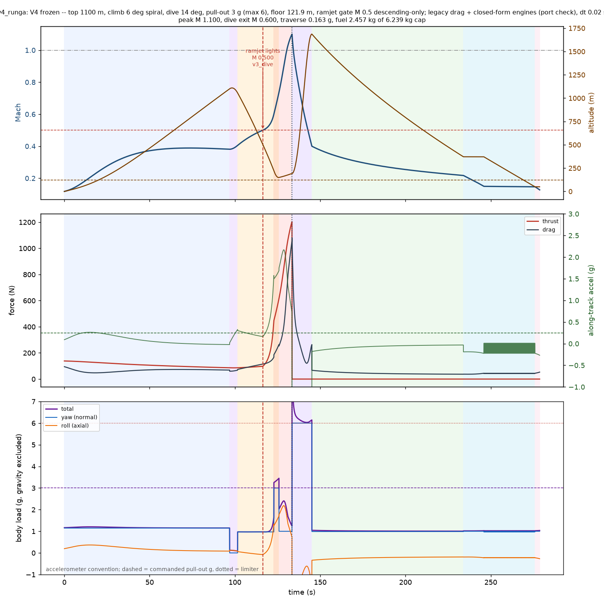

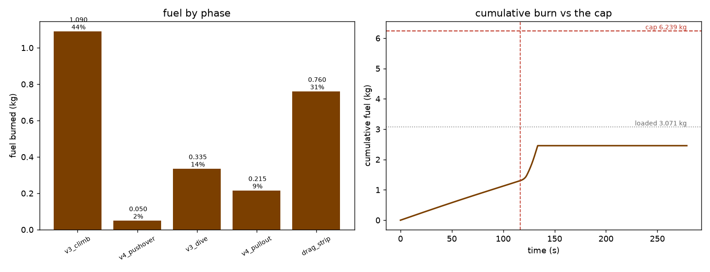

### Rung B


### Rung C

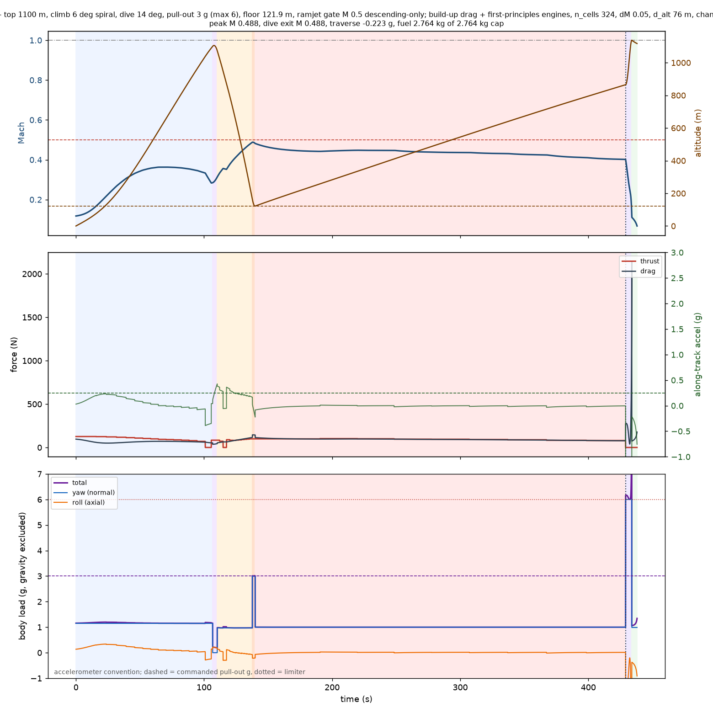

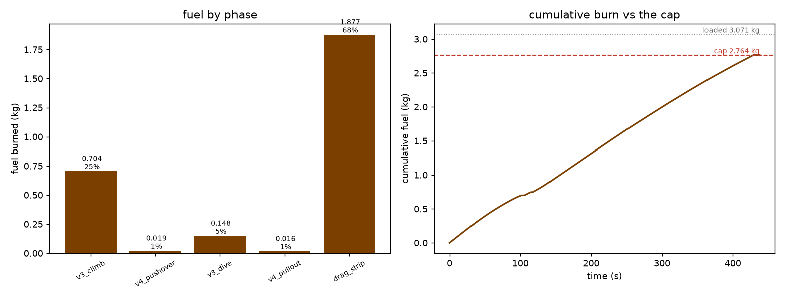

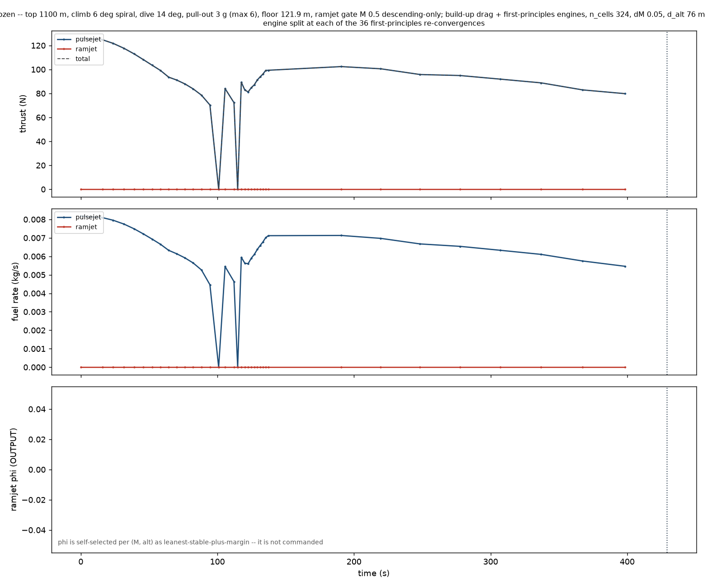

### Rung A+

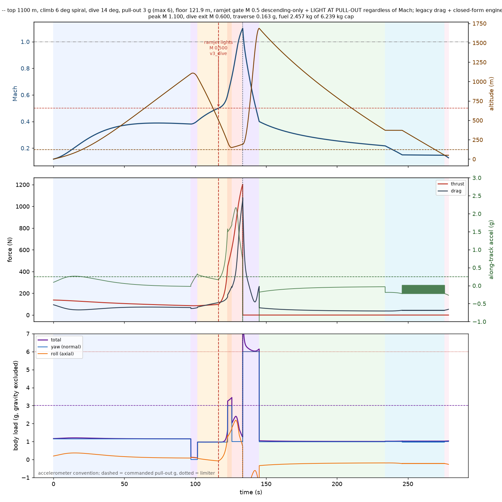


### Rung B+

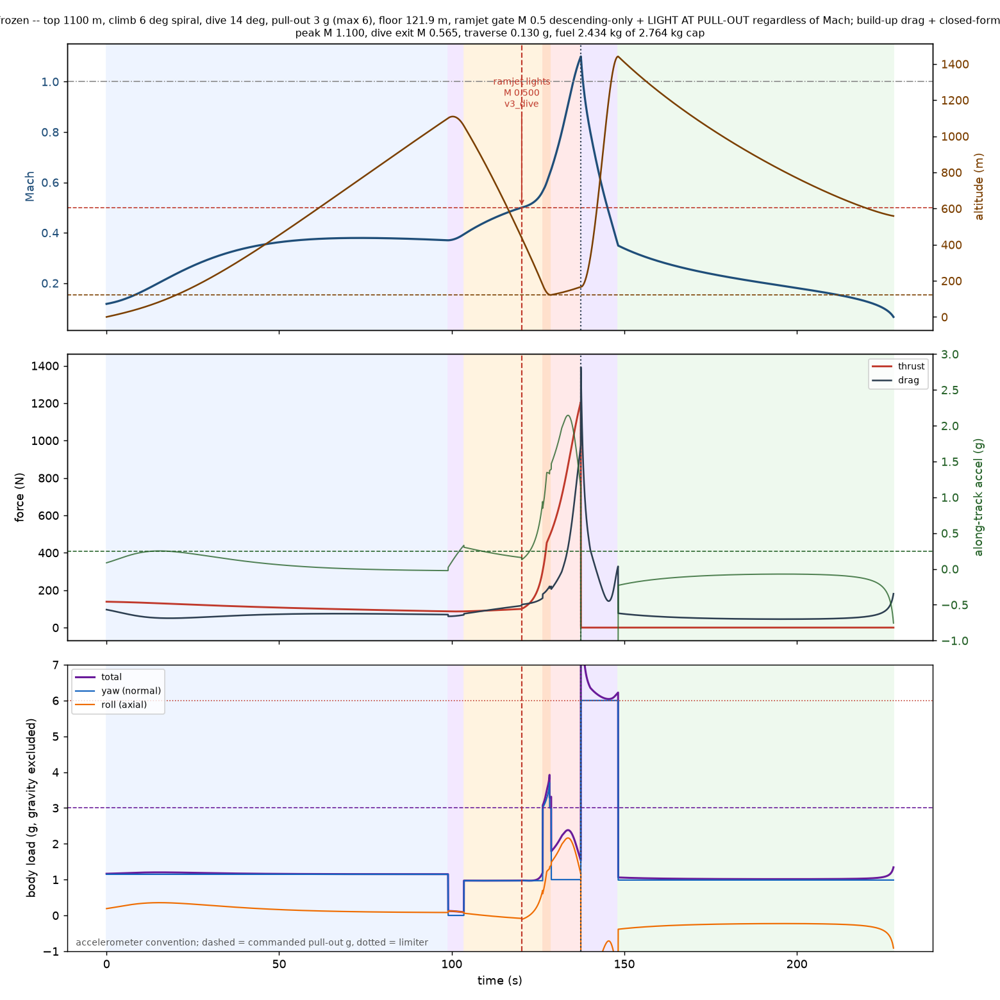

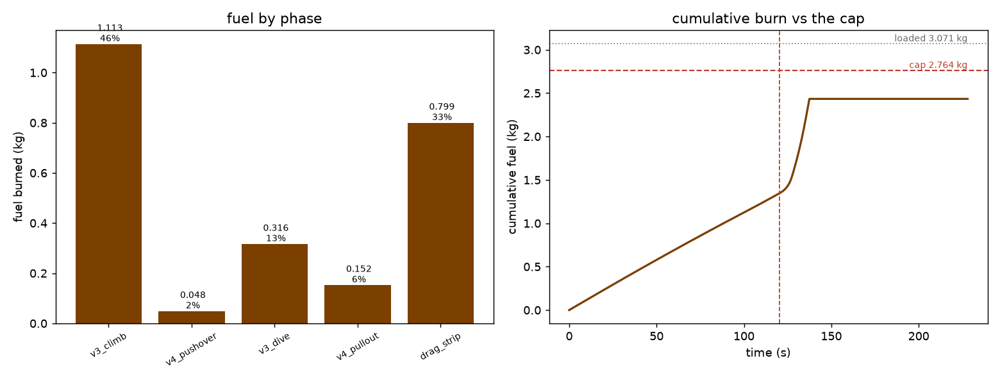

### Rung C+

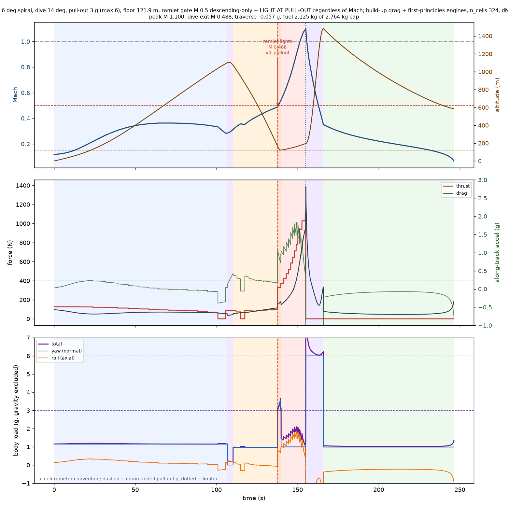

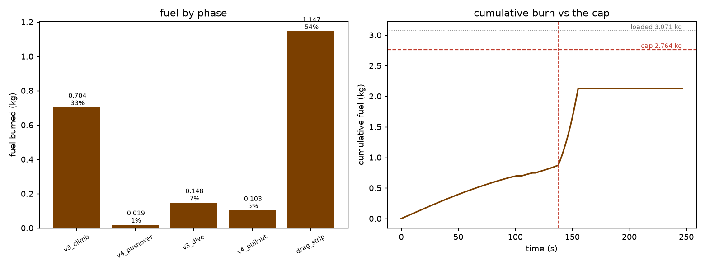

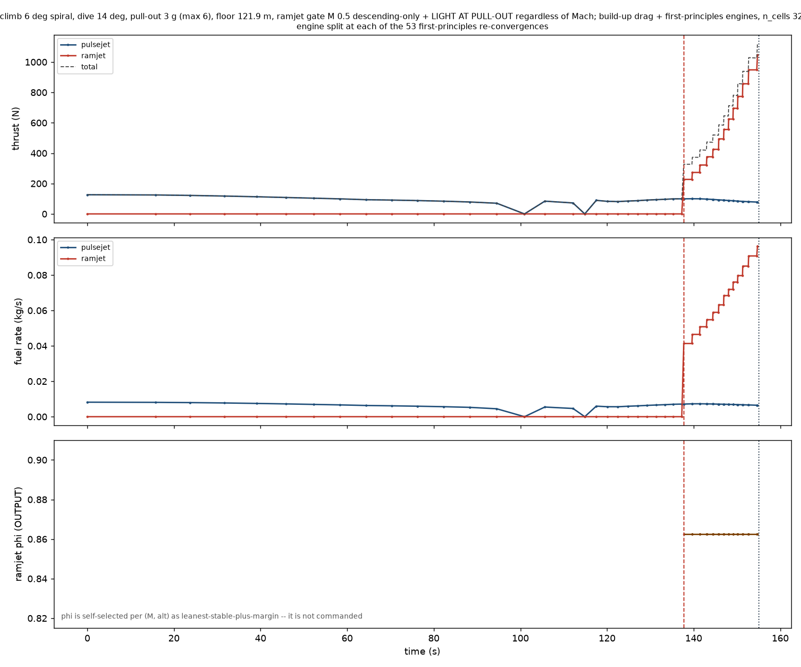

## 6. Reproduce

```bash
PYTHONPATH=. .venv/Scripts/python scripts/medium_model_v4_final.py --rung a
PYTHONPATH=. .venv/Scripts/python scripts/medium_model_v4_final.py --rung b
PYTHONPATH=. .venv/Scripts/python scripts/medium_model_v4_final.py --rung c --n-cells 324 --chamber-fraction 1
PYTHONPATH=. .venv/Scripts/python scripts/medium_model_v4_final.py --rung a --light-at-pullout
PYTHONPATH=. .venv/Scripts/python scripts/medium_model_v4_final.py --rung b --light-at-pullout
PYTHONPATH=. .venv/Scripts/python scripts/medium_model_v4_final.py --rung c --n-cells 324 --chamber-fraction 1 --light-at-pullout
PYTHONPATH=. .venv/Scripts/python scripts/medium_model_v4_report.py
```
