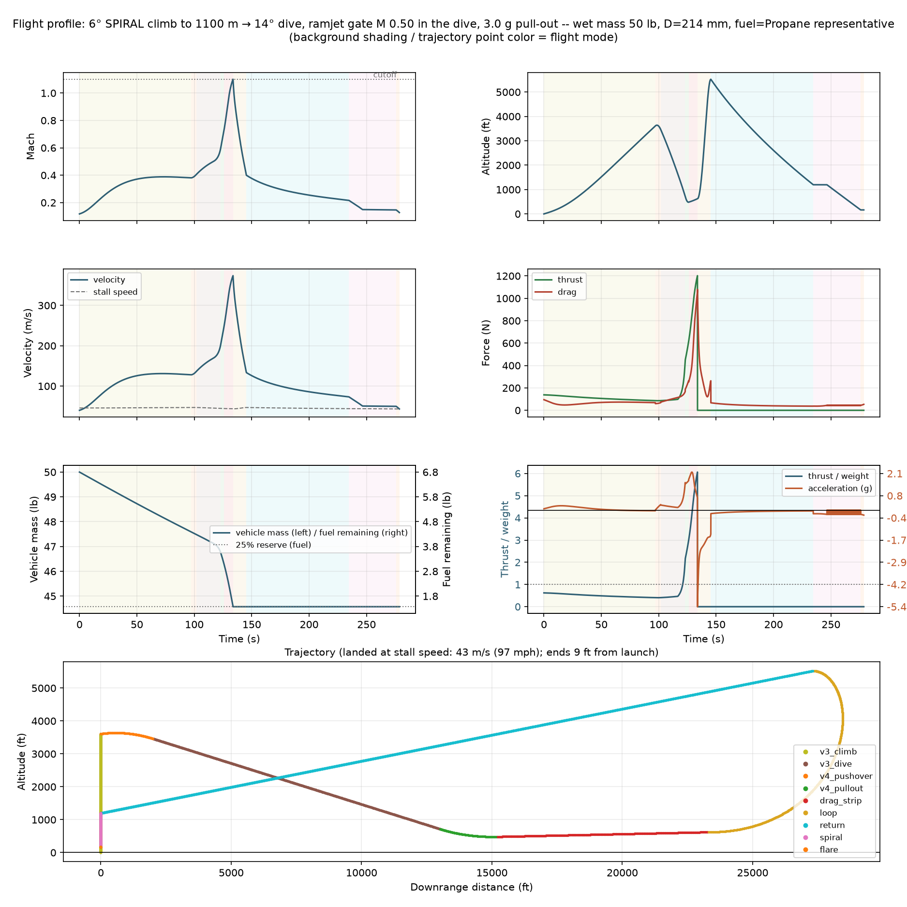
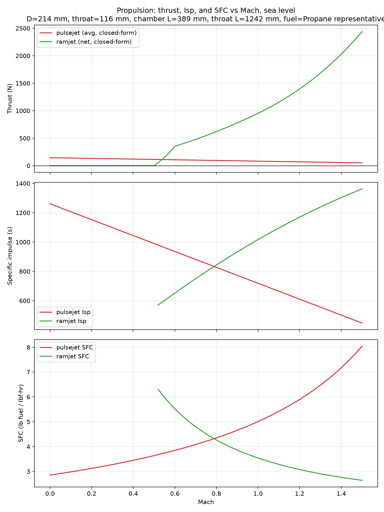
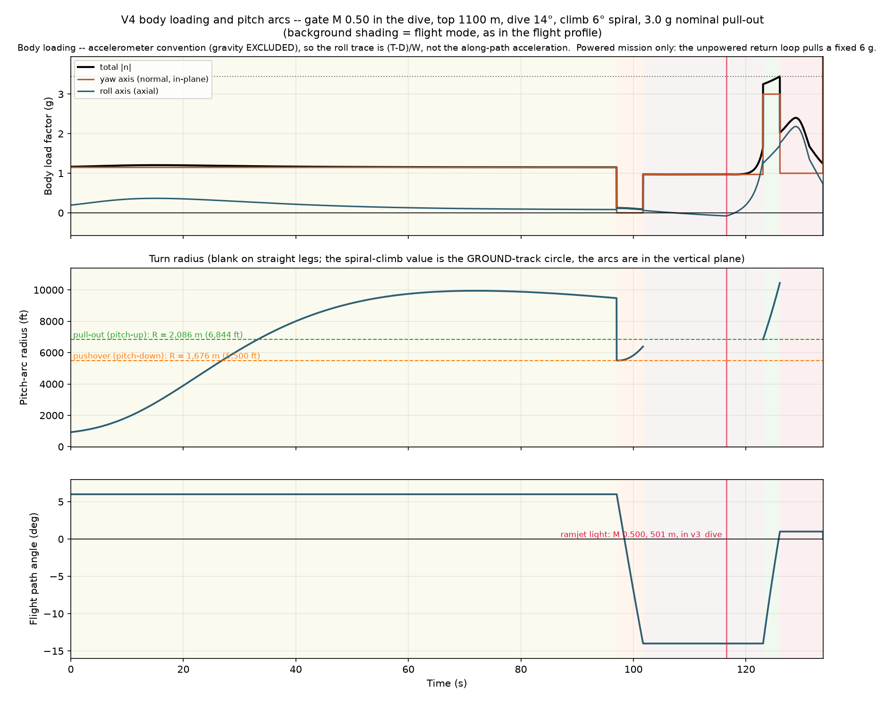

# V4 optimal design — ramjet lights in the dive

Generated by `scripts/simple_model_v4_report.py`. Closed-form `simple_model`,
CD0_FRONTAL = 0.1. **V2 and V3 remain frozen and untouched**
(`docs/v2_frozen/`, `docs/v3_frozen/`, re-verified bit-identical).

## The design

| item | value |
|---|---|
| body = chamber diameter | 214.0 mm |
| throat diameter | 115.6 mm (area fraction 0.2916) |
| chamber length | 389.3 mm |
| duct (cone + tailpipe) | 1242.3 mm |
| body length (nose+tail incl.) | 2274 mm |
| wing | span 533 mm, AR 1.860, taper 0.512, sweep 13.42°, Thin cambered plate |
| fuel | Propane representative |

## The trajectory

| item | value |
|---|---|
| **ramjet gate** | **M 0.50, must be crossed while descending** |
| top of climb | 1100 m (commanded) |
| climb | 6° **spiral**, 30° bank, ground-track R = 2,888 m |
| pushover (pitch-down) arc | R = **1,676 m**, 4.7 s, 1.15→0 g commanded |
| dive | 14° |
| pull-out (pitch-up) arc | R = **2,086 m**, 3.0 s, 3.0 g nominal |
| floor | 121.9 m, flown minimum 146.4 m |
| drag strip | 1.0° to cutoff |

## Mission result

| metric | value |
|---|---|
| ramjet lightoff | **M 0.500 at 501 m, t 116.6 s, in `v3_dive`** |
| lit in the dive | **True** |
| dive exit Mach | 0.600 — this is the `dive_end_mach` cap, **not** spare reachability (see below) |
| peak Mach | 1.100 |
| motor cutoff reached | True |
| peak T/W | 6.06 |
| min traverse acceleration | 0.163 g @ M 0.50 — **below the 0.25 g gate** |
| min powered acceleration | -0.0213 g @ M 0.381 — **negative, at the top of climb** |
| min thrust margin (engine-only) | 0.855 — **below the 1.15 gate** |
| **peak body load (total)** | **3.45 g** in `v4_pullout` |
| peak yaw-axis (normal) load | 3.00 g |
| peak roll-axis (axial) load | 2.18 g |
| fuel burned / tank capacity | 2.461 / 7.803 kg |
| dry mass (re-derived) | 14.924 kg |
| **payload margin** | **4.679 kg** |
| stall speed at landing | 43.3 m/s (cap 45) |
| safe landing | True |
| **pulsejet thrust loss tolerated** | **−10.0 %** and still lights in the dive |

## Phases

| phase | t (s) | altitude (m) | Mach | γ (deg) | peak load (g) |
|---|---|---|---|---|---|
| spiral climb | 0.0 – 97.0 | 0 → 1100 | 0.118 → 0.381 | +6.0 → +6.0 | 1.21 |
| pushover arc | 97.0 – 101.7 | 1100 → 1056 | 0.381 → 0.405 | +6.0 → -14.0 | 0.12 |
| dive | 101.7 – 123.0 | 1055 → 219 | 0.405 → 0.599 | -14.0 → -14.0 | 1.65 |
| pull-out arc | 123.0 – 126.0 | 218 → 147 | 0.600 → 0.736 | -14.0 → +0.9 | 3.45 |
| drag strip | 126.0 – 133.7 | 147 → 190 | 0.737 → 1.100 | +1.0 → +1.0 | 2.40 |

## What the M 0.50 gate costs

Most-robust design at each gate on the *same airframe*. "−thrust %" is how
much pulsejet thrust the design can lose and still light in the dive — the
only margin that means anything for a gate this close to the vehicle's
ceiling.

| gate | −thrust % tolerated | payload (kg) | peak T/W | peak load (g) | traverse (g) | top (m) |
|---|---|---|---|---|---|---|
| 0.42 | 10.0 | 5.119 | 5.89 | 3.49 | 0.415 | 800 |
| 0.45 | 10.0 | 5.047 | 5.87 | 3.37 | 0.227 | 800 |
| 0.48 | 10.0 | 5.089 | 6.00 | 3.08 | 0.282 | 800 |
| **0.50** | 10.0 | 4.730 | 6.07 | 3.96 | 0.196 | 1100 |
| **0.51** | 8.0 | 4.591 | 6.10 | 3.23 | 0.175 | 1200 |
| **0.52** | 3.8 | 4.572 | 6.10 | 2.80 | 0.191 | 1200 |

Gates below 0.50 are **context only** — they are flown to price the directive,
not to propose a lower gate.

Note the 0.50 row is the *highest-payload* design at that robustness level
(dive 16°); the **frozen** design is dive 14°, which gives up 0.05 kg of
payload to carry 0.5 g less body load. Reading across, the directive costs
roughly **0.4 kg of payload, 0.06 of traverse acceleration, and 300 m of extra
top-of-climb** versus a 0.48 gate — and 300 m of top is the expensive part,
because it spends the margin against the pulsejet's altitude ceiling.

## Reachability ceiling

Pulsejet-only dive-exit Mach (ramjet gate set unreachable, so the dive runs on
the pulsejet alone). A gate above this can never fire in the dive:

| | value |
|---|---|
| absolute best measured | **M 0.533** (top 1200 m, dive 18°, 5 g pull-out) |
| at this design's top/dive | ~M 0.52 |
| **so M 0.55+ is unreachable** | at any top under the FP pulsejet ceiling |

A steeper dive makes this **worse**, not better, at a fixed top: at top 1000 m
and 3 g, dive 10° gives M 0.516 and dive 30° gives M 0.500. The dive is
drag-limited, so shortening the path costs more than the extra gravity buys.
Top of climb is the only lever that moves it (600 m → 1200 m: 0.482 → 0.523),
and that lever runs into the FP flame-out ceiling.

## Why the climb is a spiral

Same top (1100 m), same everything else:

| climb | min powered accel (g) | top-of-climb M | downrange at cutoff | lands safely? | payload (kg) |
|---|---|---|---|---|---|
| straight 6° | −0.0213 | 0.387 | 17.53 km | **no** | 4.749 |
| spiral 6° | −0.0213 | 0.381 | **7.10 km** | **yes** | 4.679 |
| straight 8° | −0.0193 | 0.362 | 15.14 km | **no** | 4.947 |
| spiral 8° | −0.0178 | 0.352 | **7.36 km** | **yes** | 4.850 |

The spiral costs **0.07 kg of payload and 0.006 Mach** and buys back 10.4 km of
downrange — which is the difference between landing at the launch point and
landing 4–6 km short of it. Bank load (1.155 g) and its induced drag are
charged; roll-in/roll-out and heading alignment at the top are not modelled.

## Body load is tunable with `dive_end_mach` — the cheapest knob here

The dive on this design terminates on `dive_end_mach`, **not** on the floor, so
that constant decides how fast the vehicle is when the pull-out starts — and
speed is what sets the arc load. Every row below still lights in the dive and
still survives −10 % thrust:

| `dive_end_mach` | peak load (g) | min altitude (m) | payload (kg) | peak T/W |
|---|---|---|---|---|
| 0.52 | 3.01 | 332 | 4.562 | 5.92 |
| 0.55 | 3.28 | 237 | 4.641 | 5.99 |
| 0.58 | 3.39 | 176 | 4.670 | 6.04 |
| **0.60 (frozen — V3's own value)** | **3.45** | **146** | **4.679** | **6.06** |
| 0.65 | 4.24 | 122 (on the floor) | 4.690 | 6.08 |

Frozen at 0.60 because it is V3's value and the brief was to stay close to V3,
and 3.45 g is inside the 4 g design limit. **If you want lower loads, 0.55
costs 0.04 kg of payload and buys 0.17 g less body load plus 90 m more floor
clearance** — a one-line change to `dive_end_mach` in
`docs/v4_frozen/design.json`. Above 0.65 the floor becomes binding and the
pull-out limiter starts pulling harder than the 3 g nominal to hold it.

## Gates NOT met — read this

| gate | target | V4 | note |
|---|---|---|---|
| min traverse acceleration | ≥ 0.25 g | **0.163 g** | direct cost of the 0.50 gate — 0.42 gives 0.415 g on this airframe |
| min powered acceleration | > 0 | **−0.021 g** | at the top of climb: the vehicle is *at* its climb ceiling at 1100 m. Negative at every top ≥ 800 m. |
| min powered thrust margin | ≥ 1.15 | **0.855** | engine-only margin at lightoff; never met by any V2/V3/V4 configuration |

The last two are the same engine-limited gates the V3 campaign never closed
across ~450 closed-form and ~40 FP flights. The learnings doc is explicit that
they are engine/drag problems, not trajectory problems, and V4 does not close
them either. The traverse figure *is* a V4 regression (frozen V3 scores
0.261 g) and it is the price of moving the gate from 0.45 to 0.50.

## Biggest risk

Top of climb 1100 m sits just under the FP pulsejet flame-out ceiling
(~1250 m alive / 1275 m dead at CONFIRM — **and that ceiling dropped ~200 m
when the grid was refined from 162 to 324 cells**). `simple_model` has no
flame-out model at all; it only lapses thrust as (ρ/ρ_SL)³. Independently,
this model already shows the climb going marginally negative in acceleration
at that altitude, which is the same wall the FP model found ("at 1100 m the
duct makes 83.5 N; an 8° climb needs ~81 N"). **This is the number to check
first in `medium_model`.**

## Alternative — more payload, one step less robust

`top 1100 m, dive 18°, climb 8° spiral, pull-out 2.0 g`, same M 0.50 gate:
payload **4.925 kg**, peak load **3.13 g**, T/W **6.03**, traverse **0.235 g**,
tolerates **−8 %** thrust. Better on all four stated criteria; chosen against
only because V3's headline failure was a design that passed at one fidelity
and failed at the next. Switch by editing `out_simple_model/v4_pick.json`.

## Plots

The established flight-profile layout: mode shading on every time panel,
ft/lb units, mode-coloured trajectory (the spiral climb is the vertical track
at downrange 0; the pushover and pull-out arcs are the orange and green
segments).

Body loading and the pitch arcs, same visual language, framed on the powered
mission (the unpowered return half-loop pulls a fixed 6 g by construction and
would otherwise set the scale):

